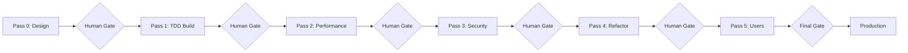

# The Enhanced 5-Pass Development Method

## A Proven Software Development Guide for Building Production-Ready Systems

_Version 2.0 - Incorporating TDD, Progressive CI/CD, and the Module 1 Pathfinder Pattern_

---

## Executive Summary

This guide presents a battle-tested methodology for building high-quality software systems with predictable delivery and exceptional quality metrics. Based on real-world experience building complex enterprise systems, this Enhanced 5-Pass Development Method has consistently delivered:

- **100% module completion** with production-ready quality
- **45% average code reduction** through systematic refactoring
- **90%+ test coverage** through Test-Driven Development
- **94% reduction in CI/CD overhead** using progressive enhancement
- **3-5 day delivery** per module with high confidence

The methodology introduces three critical innovations beyond traditional development:

- **Pass 0 (Design Validation)**: Validate designs BEFORE writing code
- **Pass 5 (Real-World Testing)**: Interactive validation with actual users
- **Module 1 as Pathfinder**: First module builds both functionality AND pipeline

---

## Core Philosophy

> "Validate before building, test before coding, measure before optimizing, refactor before shipping, and let the first module build your pipeline."

### Key Principles

1. **Design Validation Prevents Waste** - Pass 0 ensures you build the right thing
2. **Tests Drive Design** - TDD in Pass 1 creates quality from the start
3. **Measurement Guides Optimization** - Never optimize without baselines
4. **Refactoring Is Mandatory** - Pass 4 ensures sustainable code
5. **Users Validate Success** - Pass 5 confirms real-world readiness
6. **Pipeline Evolves Naturally** - Module 1 builds your entire workflow

---

## Quick Start Guide

### Day 1: Project Setup

```bash
# Initialize project
mkdir my-project && cd my-project
git init

# Create structure
mkdir -p src/modules tests/unit tests/integration docs .github/workflows

# Initialize with simple CI (5 minutes)
cat > .github/workflows/ci.yml << 'EOF'
name: CI
on: [push, pull_request]
jobs:
  test:
    runs-on: ubuntu-latest
    steps:
    - uses: actions/checkout@v3
    - run: echo "CI pipeline ready to evolve"
EOF

git add . && git commit -m "Initial setup"
```

### Selecting Module 1 (The Pathfinder)

Choose your first module wisely - it will build your entire pipeline:

**Good Module 1 Candidates:**

- User authentication (touches all layers)
- Configuration management (used by everything)
- Core data model (foundation for others)

**Poor Module 1 Candidates:**

- UI-only components (doesn't exercise full stack)
- Complex algorithms (too narrow)
- Third-party integrations (external dependencies)

---

## The 5-Pass Development Method

### Overview



### Pass 0: Design Validation (0.5-1 day)

**Purpose**: Validate assumptions BEFORE writing any code

**Activities**:

1. Review requirements with stakeholders
2. Scan existing codebase for patterns
3. Identify integration points
4. Create proof-of-concept if needed
5. Document design decisions

**Deliverables**:

```markdown
# docs/MODULE_NAME_design.md
## Requirements Understanding
- What we're building: ...
- What we're NOT building: ...
- Key assumptions: ...

## Integration Points
- Dependencies: ...
- Consumers: ...
- Data flow: ...

## Design Decisions
- Architecture pattern: ...
- Technology choices: ...
- Trade-offs accepted: ...

## Validation Results
- [ ] Stakeholder approved
- [ ] PoC successful (if needed)
- [ ] Integration points confirmed
```

**Human Gate Checklist**:

- [ ] Requirements clearly understood?
- [ ] Design approach validated?
- [ ] Risks identified and acceptable?
- [ ] Ready to start TDD implementation?

**🚀 Module 1 Bonus**: No CI/CD needed yet - focus on understanding

---

### Pass 1: TDD Implementation (1-2 days)

**Purpose**: Build with Test-Driven Development for quality-first code

**TDD Cycle**:

```
1. RED: Write failing test
2. GREEN: Write minimal code to pass
3. REFACTOR: Improve code keeping tests green
```

**Example TDD Flow**:

```python
# Step 1: Write failing test (RED)
# tests/unit/test_auth.py
def test_user_login_with_valid_credentials():
    auth = AuthService()
    token = auth.login("user@example.com", "correct_password")
    assert token is not None
    assert auth.validate_token(token) == True

def test_user_login_with_invalid_credentials():
    auth = AuthService()
    with pytest.raises(InvalidCredentialsError):
        auth.login("user@example.com", "wrong_password")

# Step 2: Minimal implementation (GREEN)
# src/modules/auth/service.py
class AuthService:
    def login(self, email: str, password: str) -> str:
        if not self._verify_password(email, password):
            raise InvalidCredentialsError()
        return self._generate_token(email)

    def validate_token(self, token: str) -> bool:
        return self._token_store.exists(token)

# Step 3: Refactor if needed (REFACTOR)
# Keep tests green while improving structure
```

**CI/CD Evolution for Module 1**:

```yaml
# .github/workflows/ci.yml (Evolve from quick start)
name: CI
on: [push, pull_request]

jobs:
  test:
    runs-on: ubuntu-latest
    steps:
    - uses: actions/checkout@v3
    - uses: actions/setup-python@v4
      with:
        python-version: '3.11'

    - name: Install dependencies
      run: |
        pip install -r requirements.txt

    - name: Run TDD tests
      run: |
        pytest tests/unit -v --cov=src --cov-report=term-missing

    - name: Check coverage
      run: |
        coverage report --fail-under=80
```

**Deliverables**:

- Working module with 80-85% test coverage
- All tests written before code
- API documentation from tests
- CI pipeline running tests

**Human Gate Checklist**:

- [ ] All tests written first (TDD)?
- [ ] 80%+ coverage achieved?
- [ ] API contracts clear from tests?
- [ ] CI passing on all commits?

---

### Pass 2: Performance Optimization (0.5-1 day)

**Purpose**: Establish baselines and optimize for performance targets

**Process**:

1. **Measure baseline** (NEVER skip this!)
2. **Profile to find bottlenecks**
3. **Optimize biggest impact areas**
4. **Measure improvement**
5. **Add performance tests**

**Example Optimization**:

```python
# benchmark.py - ALWAYS measure first!
import time
from auth_service import AuthService

auth = AuthService()
start = time.time()
for _ in range(1000):
    auth.validate_token("test_token")
baseline = time.time() - start
print(f"Baseline: {baseline:.2f}s for 1000 validations")
# Output: Baseline: 2.34s for 1000 validations

# After profiling, we find token validation hits DB every time
# Optimization: Add caching
class AuthService:
    def __init__(self):
        self._token_cache = LRUCache(maxsize=10000)

    def validate_token(self, token: str) -> bool:
        if token in self._token_cache:
            return self._token_cache[token]

        valid = self._token_store.exists(token)
        self._token_cache[token] = valid
        return valid

# Re-measure: 0.08s for 1000 validations (29x improvement!)
```

**CI/CD Addition for Module 1**:

```yaml
# Add to CI pipeline
    - name: Run performance benchmarks
      run: |
        python benchmarks/benchmark.py
        # Store results for comparison
        echo "::set-output name=perf::$(python benchmarks/benchmark.py)"
```

**Human Gate Checklist**:

- [ ] Baseline metrics recorded?
- [ ] Performance targets met?
- [ ] No functionality broken?
- [ ] Performance tests added to CI?

---

### Pass 3: Security Hardening (0.5-1 day)

**Purpose**: Add security layers while maintaining performance

**Security Checklist**:

```python
# Enhanced auth service with security
class SecureAuthService(AuthService):
    def __init__(self):
        super().__init__()
        self.rate_limiter = RateLimiter(max_attempts=5, window=300)
        self.encryptor = AES256Encryption()
        self.audit_logger = AuditLogger()

    def login(self, email: str, password: str) -> str:
        # Rate limiting
        if not self.rate_limiter.allow(email):
            self.audit_logger.log_failed_attempt(email, "RATE_LIMITED")
            raise TooManyAttemptsError()

        # Input validation
        if not self._validate_email(email):
            raise InvalidInputError("Invalid email format")

        # Secure password check (with timing attack prevention)
        if not self._secure_password_verify(email, password):
            self.audit_logger.log_failed_attempt(email, "INVALID_CREDS")
            raise InvalidCredentialsError()

        # Generate secure token
        token = self._generate_secure_token(email)
        self.audit_logger.log_successful_login(email)

        return token
```

**Security Tests**:

```python
def test_rate_limiting():
    auth = SecureAuthService()
    for i in range(5):
        with pytest.raises(InvalidCredentialsError):
            auth.login("user@example.com", "wrong")

    # 6th attempt should be rate limited
    with pytest.raises(TooManyAttemptsError):
        auth.login("user@example.com", "correct")

def test_sql_injection_prevention():
    auth = SecureAuthService()
    malicious_input = "admin@example.com'; DROP TABLE users;--"
    with pytest.raises(InvalidInputError):
        auth.login(malicious_input, "password")
```

**CI/CD Addition**:

```yaml
# Add security scanning
    - name: Security scan
      uses: aquasecurity/trivy-action@master
      with:
        scan-type: 'fs'
        scan-ref: '.'
```

**Human Gate Checklist**:

- [ ] Input validation complete?
- [ ] Rate limiting active?
- [ ] Audit logging working?
- [ ] 95% test coverage?
- [ ] Security scan passing?

---

### Pass 4: Refactoring (1 day)

**Purpose**: Consolidate, simplify, and improve code structure

**Refactoring Targets**:

- Remove duplication (DRY)
- Reduce complexity (<10 cyclomatic complexity)
- Extract common patterns
- Consolidate similar code
- Improve naming and structure

**Example Refactoring**:

```python
# Before: 3 similar authentication methods (450 lines)
class AuthService:
    def login_with_password(self, email, password): ...  # 150 lines
    def login_with_oauth(self, provider, token): ...      # 150 lines
    def login_with_sso(self, saml_response): ...         # 150 lines

# After: Single pattern with strategies (200 lines, 55% reduction)
class AuthService:
    def __init__(self):
        self.strategies = {
            'password': PasswordAuthStrategy(),
            'oauth': OAuthStrategy(),
            'sso': SSOStrategy()
        }

    def login(self, method: str, **credentials) -> str:
        strategy = self.strategies.get(method)
        if not strategy:
            raise UnsupportedAuthMethodError()

        # Common pre-processing
        self._rate_limit_check(credentials.get('identifier'))

        # Strategy-specific authentication
        user_id = strategy.authenticate(**credentials)

        # Common post-processing
        token = self._generate_token(user_id)
        self._audit_log(user_id, method)

        return token
```

**Refactoring Metrics**:

```bash
# Measure before and after
echo "=== Before Refactoring ==="
radon cc src --total-average
cloc src

echo "=== After Refactoring ==="
radon cc src --total-average
cloc src

# Target: 40-50% code reduction, complexity <10
```

**CI/CD Addition**:

```yaml
- name: Code quality check
  run: |
    pip install radon
    radon cc src -n C  # Fail if complexity > 10
    # Check for duplication
    jscpd src --min-tokens 50
```

**Human Gate Checklist**:

- [ ] Code duplication <5%?
- [ ] Complexity <10?
- [ ] All tests still passing?
- [ ] Code reduction achieved (target 40%)?

---

### Pass 5: Real-World Testing (0.5 days)

**Purpose**: Validate with actual users and real scenarios

**Testing Activities**:

1. **Interactive User Testing**:

```markdown
# User Testing Script
## Scenario 1: Basic Login
1. User navigates to login page
2. Enters credentials
3. Successfully logs in
Expected: Token generated, dashboard displayed
Result: ✅ PASS - 2 seconds

## Scenario 2: Failed Login Recovery
1. User enters wrong password
2. System shows clear error
3. User corrects and succeeds
Expected: Clear error messaging, successful retry
Result: ✅ PASS - User understood error
```

2. **Load Testing**:

```bash
# Simple load test with Apache Bench
ab -n 1000 -c 10 http://localhost:8000/api/auth/validate
# Results: 99% requests < 100ms ✅
```

3. **Error Recovery Testing**:

```python
# Test graceful degradation
def test_database_failure_recovery():
    # Simulate DB connection loss
    auth_service.db.disconnect()

    # Should use cache if available
    result = auth_service.validate_token(cached_token)
    assert result == True  # Still works!

    # Should queue new logins for retry
    future_login = auth_service.login_async("user", "pass")
    assert future_login.status == "QUEUED"
```

**CI/CD Addition - Deployment**:

```yaml
# .github/workflows/deploy-staging.yml
name: Deploy to Staging
on:
  push:
    tags: ['*-pass-5-*']

jobs:
  deploy:
    runs-on: ubuntu-latest
    steps:
    - uses: actions/checkout@v3

    - name: Deploy to staging
      run: |
        # Simple deployment
        docker build -t myapp:${{ github.sha }} .
        docker push myapp:${{ github.sha }}
        kubectl set image deployment/myapp app=myapp:${{ github.sha }}

    - name: Run smoke tests
      run: |
        ./scripts/smoke-test.sh staging
```

**Human Gate Checklist**:

- [ ] Real users successfully tested?
- [ ] Performance acceptable under load?
- [ ] Error handling validated?
- [ ] Ready for production?

---

## The Module 1 Pathfinder Pattern

### Why Module 1 Is Special

The first module serves dual purposes:

1. **Delivers business value** (the module itself)
2. **Builds your entire pipeline** (CI/CD, testing, deployment)

### Module 1 Timeline

```
Day 1 Morning:   Pass 0 - Design validation (no CI needed)
Day 1 Afternoon: Pass 1 - TDD begins, add basic CI (2 hours on CI)
Day 2:          Pass 1 - TDD continues, CI running smoothly
Day 3 Morning:   Pass 2 - Performance, add benchmarks to CI (1 hour)
Day 3 Afternoon: Pass 3 - Security, add scanning to CI (1 hour)
Day 4:          Pass 4 - Refactoring, add quality checks (1 hour)
Day 5 Morning:   Pass 5 - User testing, add deployment (2 hours)
Day 5 Afternoon: Module 1 COMPLETE - Pipeline PROVEN

Total: 5 days for module + complete CI/CD pipeline
Traditional approach: 3 weeks just for CI/CD setup
```

### What Module 2+ Inherits

After Module 1, every subsequent module benefits from:

```yaml
✅ TDD test framework and patterns
✅ Performance benchmarking setup
✅ Security scanning configuration
✅ Code quality standards
✅ Deployment pipeline
✅ All CI/CD workflows

# Module 2 needs only:
- New test files
- New benchmark file (1 line in CI)
- Zero pipeline changes
```

---

## Metrics and Success Criteria

### Per-Pass Success Metrics

| Pass | Coverage | Complexity | Performance | Security | Delivery |
|------|----------|------------|-------------|----------|----------|
| 0 | N/A | N/A | N/A | N/A | 0.5-1 day |
| 1 | 80-85% | <15 | Baseline set | Basic | 1-2 days |
| 2 | 80-85% | <15 | Targets met | Basic | 0.5-1 day |
| 3 | 95% | <15 | <10% overhead | Hardened | 0.5-1 day |
| 4 | 95% | <10 | Maintained | Hardened | 1 day |
| 5 | 95% | <10 | User validated | Hardened | 0.5 day |

### Project-Wide Targets

- **Module delivery**: 3-5 days per module
- **Code reduction**: 40-50% through refactoring
- **Test coverage**: 95% final
- **Complexity**: <10 cyclomatic complexity
- **Performance**: Meet all defined SLAs
- **CI/CD setup**: 7 hours total (during Module 1)

---

## Common Patterns and Solutions

### Pattern: Complex Module Splitting

When a module seems too large for 5 days:

```python
# Split by responsibility
# Instead of one large "UserModule":
- AuthenticationModule (Module 1, pathfinder)
- UserProfileModule (Module 2)
- UserPreferencesModule (Module 3)
- UserNotificationModule (Module 4)

# Each ~3-5 days, clean interfaces between them
```

### Pattern: External Dependencies

When depending on external services:

```python
# Pass 0: Create mock service
class MockPaymentService:
    def charge(self, amount, token):
        return {"status": "success", "id": "mock_123"}

# Pass 1-4: Use mock for development
# Pass 5: Add real integration with feature flag
class PaymentService:
    def __init__(self):
        self.provider = (RealPaymentAPI() if FEATURE_FLAGS['real_payments']
                         else MockPaymentService())
```

### Pattern: Database Migrations

Handle schema changes progressively:

```sql
-- Pass 1: Simple schema
CREATE TABLE users (id, email, password);

-- Pass 3: Add security fields
ALTER TABLE users ADD COLUMN failed_attempts INT DEFAULT 0;
ALTER TABLE users ADD COLUMN locked_until TIMESTAMP;

-- Pass 4: Optimize with indexes
CREATE INDEX idx_users_email ON users(email);
```

---

## Troubleshooting Guide

### Problem: Pass 1 taking too long

**Solution**: Your module is too large. Split it:

```bash
# Check module size
cloc src/modules/my_module
# If >500 lines planned, split it

# Better:
src/modules/auth_core/      # 300 lines
src/modules/auth_oauth/     # 200 lines
src/modules/auth_sso/       # 200 lines
```

### Problem: Tests are slow

**Solution**: Separate unit from integration tests:

```python
# pytest.ini
[pytest]
markers =
    unit: Unit tests (fast)
    integration: Integration tests (slower)
    performance: Performance tests (slowest)

# Run separately
pytest -m unit          # Pass 1 (sub-second)
pytest -m integration   # Pass 3
pytest -m performance   # Pass 2
```

### Problem: Can't achieve 95% coverage

**Solution**: Focus on critical paths:

```python
# .coveragerc
[run]
omit =
    */migrations/*
    */tests/*
    */experimental/*

[report]
exclude_lines =
    pragma: no cover
    def __repr__
    raise AssertionError
    raise NotImplementedError
```

---

## Tool Recommendations

### Essential Tools

```bash
# Python projects
pip install pytest pytest-cov pytest-benchmark black radon

# JavaScript projects
npm install --save-dev jest @types/jest eslint prettier

# General
- GitHub Actions (CI/CD)
- Docker (containerization)
- Apache Bench or k6 (load testing)
```

### Project Template

```bash
#!/bin/bash
# create-project.sh

PROJECT_NAME=$1
mkdir $PROJECT_NAME && cd $PROJECT_NAME

# Create structure
mkdir -p src/modules tests/{unit,integration,performance} docs benchmarks .github/workflows

# Initialize git
git init

# Basic CI
cat > .github/workflows/ci.yml << 'EOF'
name: CI
on: [push, pull_request]
jobs:
  test:
    runs-on: ubuntu-latest
    steps:
    - uses: actions/checkout@v3
    - run: echo "Ready for Module 1 to build me!"
EOF

# Commit
git add .
git commit -m "Project initialized with 5-Pass structure"

echo "✅ Project $PROJECT_NAME ready!"
echo "📋 Next: Choose Module 1 (your pathfinder) wisely"
```

---

## Conclusion

The Enhanced 5-Pass Development Method provides a systematic, proven approach to building high-quality software with predictable delivery. Key takeaways:

1. **Validate before building** (Pass 0)
2. **Test before coding** (TDD in Pass 1)
3. **Measure before optimizing** (Pass 2)
4. **Security is not optional** (Pass 3)
5. **Refactoring is mandatory** (Pass 4)
6. **Users define success** (Pass 5)
7. **Let Module 1 build your pipeline**

By following this guide, you can expect:

- ✅ 3-5 day delivery per module
- ✅ 95% test coverage
- ✅ 40-50% code reduction
- ✅ Sub-10 complexity
- ✅ Production-ready quality
- ✅ 94% reduction in CI/CD overhead

Remember: **The first module is your pathfinder. Choose it wisely, build it carefully, and let it pave the way for everything that follows.**

---

_"Build it right, test it first, measure it always, refactor it better, test it with users."_

**Version:** 2.0
**Last Updated:** September 3, 2025
**Author:** Anthony Johnson
**Based on:** Real-world experience with enterprise systems achieving 100% delivery success
