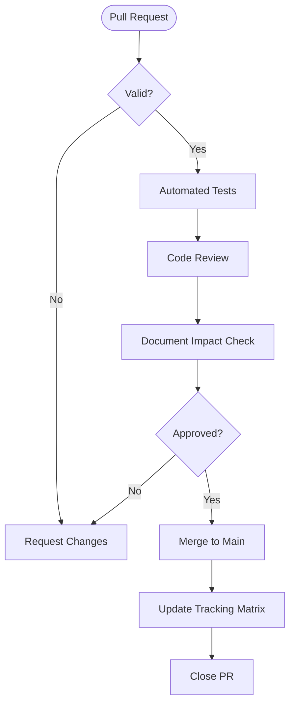

# DevDocAI-v3.0 Software Configuration Management Plan (SCMP)

---
⚠️ **STATUS: DESIGN SPECIFICATION - NOT IMPLEMENTED** ⚠️

**Document Type**: Design Specification  
**Implementation Status**: 0% - No code written  
**Purpose**: Blueprint for future development  

> **This document describes planned functionality and architecture that has not been built yet.**
> All code examples, commands, and installation instructions are design specifications for future implementation.

---

🏗️ **TECHNICAL SPECIFICATION STATUS**

This document contains complete technical specifications ready for implementation.
Contributors can use this as a blueprint to build the described system.

---

**Document Version:** 2.0  
**Date:** August 20, 2025  
**Status:** Revised  
**Classification:** Open Source Project Documentation  

---

## Summary of Changes (Version 2.0)

This revision incorporates the following major updates:

- Realigned target audience to solo and independent developers (not enterprise)
- Expanded scope to include document generation AND analysis capabilities
- Added comprehensive document tracking matrix for version control and consistency
- Included support for all document types across the software development lifecycle
- Integrated comprehensive review types covering all quality dimensions
- Enhanced MIAIR methodology integration details
- Added privacy-first, local operation architecture with optional cloud features
- Updated interfaces to focus on VS Code extension and high-quality CLI
- Adjusted management structure for open source and solo developer workflows
- Added plugin architecture and extensibility features

---

## 1. Introduction

### 1.1 Purpose

This Software Configuration Management Plan (SCMP) establishes the configuration management policies, procedures, and tools for the DevDocAI-v3.0 project. It defines how configuration items will be identified, controlled, tracked, and audited throughout the software development lifecycle to ensure the integrity and traceability of all project artifacts, with special focus on document generation, analysis, and consistency management for solo and independent developers.

### 1.2 Scope

This SCMP applies to all configuration items related to DevDocAI-v3.0, including:

- Source code for document generation and analysis engines
- All supported document types across the SDLC
- Document tracking matrix and consistency management tools
- Requirements, design, and test artifacts
- Build and deployment configurations
- Third-party dependencies and LLM integrations
- Development and production environments
- VS Code extension and CLI interfaces
- Plugin architecture and community extensions
- Privacy and security configurations

### 1.3 System Overview

DevDocAI-v3.0 is an open-source documentation enhancement and generation system designed specifically for solo and independent software developers. Built on the Meta-Iterative AI Refinement (MIAIR) methodology, DevDocAI provides intelligent document generation from scratch, comprehensive multi-dimensional analysis, multi-LLM synthesis, and suite-level consistency checking through VS Code extension and high-quality CLI interfaces. The system achieves 97.5% quality scores through patent-worthy entropy optimization algorithms while maintaining privacy-first architecture with optional cloud features.

### 1.4 Definitions and Acronyms

| Term | Definition |
|------|------------|
| **CI** | Configuration Item - Any component under configuration control |
| **CCB** | Change Control Board - Committee responsible for approving changes |
| **DCB** | Documentation Control Board - Oversees documentation quality and standards |
| **MIAIR** | Meta-Iterative AI Refinement - Core entropy optimization engine |
| **SCM** | Software Configuration Management |
| **VCS** | Version Control System |
| **CR** | Change Request |
| **DTM** | Document Tracking Matrix - Version control and consistency system |
| **LLM** | Large Language Model (Claude, ChatGPT, Gemini) |
| **SDLC** | Software Development Lifecycle |

### 1.5 References

- DevDocAI-v3.0 User Stories & Acceptance Criteria v3.0.0
- DevDocAI-v3.0 Product Requirements Document (PRD) v1.0.0
- DevDocAI-v3.0 Software Requirements Specification (SRS) v1.0
- DevDocAI-v3.0 Software Design Document (SDD) v1.0
- DevDocAI-v3.0 Test Plan v1.0
- DevDocAI-v3.0 Architecture Blueprint
- IEEE Standard 828-2012 for Software Configuration Management Plans
- Open Source License Agreement

---

## 2. Management

### 2.1 Organization

#### 2.1.1 Configuration Management Structure for Open Source Project

```
Open Source Community
        |
Core Maintainers
        |
Configuration Manager (Lead Maintainer)
        |
    +---+---+---+
    |       |       |
Technical   Quality  Community
  Lead    Assurance  Manager
    |       Lead       |
    |         |        |
Core      Testing   Plugin
Devs      Team    Contributors
```

#### 2.1.2 Roles and Responsibilities

**Configuration Manager (Lead Maintainer)**

- Maintain and execute this SCMP
- Manage configuration item repository
- Coordinate release decisions
- Perform configuration audits
- Generate status reports
- Manage branching and merging strategies
- Oversee release management
- Maintain document tracking matrix integrity

**Technical Lead**

- Review and approve technical changes
- Define technical baselines
- Ensure architectural compliance
- Validate technical documentation
- Maintain MIAIR engine integrity
- Oversee multi-LLM integration

**Community Manager**

- Coordinate open source contributions
- Manage plugin ecosystem
- Handle community communications
- Facilitate contributor onboarding
- Maintain contribution guidelines
- Oversee documentation for solo developers

**Quality Assurance Lead**

- Validate test coverage and results
- Ensure quality gates are met
- Participate in configuration audits
- Review and approve test artifacts
- Maintain document quality standards
- Validate review type implementations

**Core Development Team**

- Follow version control procedures
- Create and update configuration items
- Participate in code reviews
- Document changes appropriately
- Report configuration issues
- Implement document generation and analysis features

**Plugin Contributors**

- Follow plugin development guidelines
- Submit plugins for review
- Maintain plugin documentation
- Respond to community feedback
- Ensure compatibility with core system

### 2.2 Configuration Management Activities

#### 2.2.1 Planning

- Define configuration baselines for core and plugins
- Establish change control procedures for open source workflow
- Set up configuration repositories (GitHub)
- Create workflow automation for contributors
- Define audit schedules
- Establish document tracking matrix structure

#### 2.2.2 Identification

- Assign unique identifiers to all CIs
- Maintain configuration item registry
- Define naming conventions for documents and code
- Establish directory structures
- Document dependencies and relationships
- Track document generation templates

#### 2.2.3 Control

- Manage pull requests and issues
- Control access permissions for repositories
- Enforce approval workflows
- Maintain version history
- Coordinate releases
- Manage document tracking matrix updates

#### 2.2.4 Status Accounting

- Track CI status and changes
- Generate configuration reports
- Maintain audit trails
- Document baselines
- Report metrics
- Track document consistency scores

#### 2.2.5 Auditing

- Conduct functional audits
- Perform physical audits
- Verify compliance
- Validate baselines
- Report findings
- Audit document generation quality

### 2.3 Tools and Infrastructure

| Tool | Purpose | Access Control |
|------|---------|----------------|
| **Git/GitHub** | Version control system | Open source/role-based |
| **Docker** | Container management | Core team |
| **VS Code** | Primary IDE integration | All users |
| **GitHub Actions** | CI/CD automation | Automated |
| **GitHub Issues** | Issue and change tracking | Community |
| **GitHub Wiki** | Documentation repository | Community |
| **SonarQube** | Code quality analysis | Core team |
| **Document Tracking Matrix** | Document version control | Integrated in DevDocAI |
| **LLM APIs** | Multi-LLM synthesis | User-configured |

---

## 3. Configuration Identification

### 3.1 Configuration Item Categories

#### 3.1.1 Supported Document Types (Comprehensive)

**Planning & Requirements Documents:**

- Project Plans & Work Breakdown Structure (WBS)
- Software Requirements Specifications (SRS)
- Product Requirements Documents (PRD)
- User Stories & Acceptance Criteria
- Use Case Documents
- Business Requirements Documents

**Design & Architecture Documents:**

- Software Design Documents (SDD)
- Architecture Blueprints
- API Specifications
- Database Schemas
- UML Diagrams & Models
- Mockups & Wireframes
- Design Patterns Documentation

**Development & Implementation Documents:**

- Source Code Documentation
- Build Instructions
- Configuration Guides
- CONTRIBUTING.md
- README files
- TODO Lists & Technical Debt Logs

**Testing & Quality Documents:**

- Test Plans & Strategies
- Test Cases (Unit/Integration/System/Acceptance)
- Test Logs & Reports
- Bug Reports & Incident Logs
- Performance Test Results
- Security Test Reports

**Operations & Maintenance Documents:**

- Installation/Deployment Instructions
- User Manuals & Guides
- Administrator Documentation
- Release Notes
- Maintenance Plans
- Troubleshooting Guides
- Disaster Recovery Plans

**Management & Compliance Documents:**

- Software Configuration Management Plans (SCMP)
- Traceability Matrices
- Quality Assurance Reports
- Risk Assessments
- Compliance Documentation
- Change Requests & Impact Analysis
- Project Status Reports

#### 3.1.2 Source Code Components

- Document generation engine
- Document analysis engine
- MIAIR optimization core
- Multi-LLM synthesis module
- Document tracking matrix system
- VS Code extension code
- CLI interface implementation
- Plugin architecture framework
- Privacy and encryption modules
- Unit and integration tests

#### 3.1.3 Third-Party Components

- Python dependencies (requirements.txt)
- Node.js dependencies (package.json) for VS Code extension
- LLM SDKs (OpenAI, Anthropic, Google)
- Docker base images
- Development tools
- Plugin dependencies

#### 3.1.4 Environments

- Local development environment (privacy-first)
- Community testing environment
- Staging environment
- Production release environment
- Plugin sandbox environment

### 3.2 Naming Conventions

#### 3.2.1 Version Numbering

```
MAJOR.MINOR.PATCH[-PRERELEASE][+BUILD]
Example: 3.0.0-beta.1+20250820
```

- **MAJOR**: Incompatible API changes
- **MINOR**: Backwards-compatible functionality
- **PATCH**: Backwards-compatible bug fixes
- **PRERELEASE**: alpha, beta, rc
- **BUILD**: Build metadata

#### 3.2.2 Branch Naming

```
<type>/<issue-number>-<brief-description>
```

Types:

- `feature/` - New features (document generation, analysis)
- `bugfix/` - Bug fixes
- `hotfix/` - Emergency production fixes
- `release/` - Release preparation
- `docs/` - Documentation updates
- `plugin/` - Plugin-related changes

Examples:

- `feature/123-document-generation-api`
- `bugfix/456-tracking-matrix-sync`
- `plugin/789-latex-support`

#### 3.2.3 Document Configuration Identifiers

```
<PROJECT>-<DOCTYPE>-<COMPONENT>-<VERSION>
```

Examples:

- `DEVDOCAI-SRS-REQUIREMENTS-3.0.0`
- `DEVDOCAI-TEST-PLAN-3.0.0`
- `DEVDOCAI-ARCH-BLUEPRINT-3.0.0`

### 3.3 Baseline Management

#### 3.3.1 Baseline Types

| Baseline Type | Description | Approval Required |
|---------------|-------------|-------------------|
| **Functional** | Initial approved requirements for solo developers | Core Maintainers |
| **Design** | Approved system design and architecture | Technical Lead |
| **Product** | Release-ready configuration | Core Team |
| **Development** | Stable development version | Technical Lead |
| **Plugin** | Approved plugin interface | Plugin Maintainer |

#### 3.3.2 Document Tracking Matrix

The Document Tracking Matrix maintains:

- Document relationships and dependencies
- Version history for each document
- Cross-references between requirements, design, code, and tests
- Consistency status indicators
- Last review dates and quality scores
- Change impact analysis predictions
- Generation vs manual creation metadata

---

## 4. Configuration Control

### 4.1 Change Control Process

#### 4.1.1 Change Categories for Open Source

| Category | Impact | Approval | Timeline |
|----------|--------|----------|----------|
| **A: Breaking** | Core API, document formats | Core Maintainers | 72 hours review |
| **B: Feature** | New capabilities, enhancements | Technical Lead + 1 | 48 hours review |
| **C: Fix** | Bug fixes, documentation | Any Maintainer | 24 hours review |
| **D: Plugin** | Plugin ecosystem changes | Plugin Maintainer | 24 hours review |
| **E: Emergency** | Security, critical bugs | Fast-track | 4 hours |

#### 4.1.2 Pull Request Workflow



#### 4.1.3 Community Change Management

**Pull Request Requirements:**

- Clear description of changes
- Link to related issue
- Test coverage for new features
- Documentation updates
- Compatibility with existing plugins
- Privacy impact assessment (if applicable)

**Review Process:**

- Automated checks (tests, linting, security)
- Peer review by community
- Maintainer approval
- Document tracking matrix update

### 4.2 Version Control Procedures

#### 4.2.1 Repository Structure

```
devdocsai-v3/
├── src/                    # Source code
│   ├── core/              # Core modules
│   │   ├── miair/        # MIAIR engine
│   │   ├── generator/    # Document generation
│   │   ├── analyzer/     # Document analysis
│   │   └── tracker/      # Document tracking matrix
│   ├── interfaces/        # User interfaces
│   │   ├── vscode/      # VS Code extension
│   │   └── cli/         # CLI implementation
│   ├── llm/              # Multi-LLM integration
│   ├── plugins/          # Plugin architecture
│   └── tests/            # Test suites
├── docs/                  # Documentation
│   ├── templates/        # Document templates
│   ├── api/             # API documentation
│   ├── user/            # User guides
│   └── developer/       # Developer guides
├── plugins/              # Community plugins
├── examples/             # Example documents
├── config/               # Configuration files
└── .github/              # GitHub workflows
```

#### 4.2.2 Branching Strategy for Open Source

**GitFlow Adapted for Community:**

- `main` - Stable releases
- `develop` - Integration branch
- `feature/*` - Feature development
- `release/*` - Release candidates
- `hotfix/*` - Emergency fixes
- `plugin/*` - Plugin development

**Branch Protection Rules:**

- `main` branch:
  - Require 2 maintainer approvals
  - Pass all quality gates
  - Document tracking matrix consistency check
  - No direct commits
  
- `develop` branch:
  - Require 1 approval
  - Pass CI/CD checks
  - No force pushes

#### 4.2.3 Commit Standards

```
<type>(<scope>): <subject>

<body>

<footer>
```

Types: feat, fix, docs, style, refactor, test, chore, plugin

Example:

```
feat(generator): add template-based document generation

- Implement document template system
- Add support for all SDLC document types
- Include tracking matrix integration

Resolves: #123
```

### 4.3 Access Control

| Role | Repository Access | Branch Permissions | Release Rights |
|------|------------------|-------------------|-----------------|
| Core Maintainers | Admin | All branches | All |
| Technical Lead | Write | All branches | Pre-release |
| Contributors | Write (Fork) | Pull requests only | None |
| Plugin Developers | Write (plugins/) | plugin/* branches | Plugin releases |
| Users | Read | None | None |

---

## 5. Configuration Status Accounting

### 5.1 Status Tracking

#### 5.1.1 Configuration Item States

| State | Description | Next States |
|-------|-------------|-------------|
| **Draft** | Under development | Review |
| **Review** | In peer review | Approved, Rejected |
| **Approved** | Approved for baseline | Baselined |
| **Baselined** | Part of baseline | Modified |
| **Modified** | Changes in progress | Review |
| **Generated** | AI-generated document | Review |
| **Enhanced** | AI-enhanced document | Review |
| **Deprecated** | Scheduled for removal | Archived |
| **Archived** | No longer active | None |

#### 5.1.2 Document Tracking Matrix Fields

| Field | Description | Update Trigger |
|-------|-------------|----------------|
| **Document ID** | Unique identifier | Creation |
| **Type** | Document category | Creation |
| **Version** | Current version number | Any change |
| **Dependencies** | Related documents | Relationship change |
| **Quality Score** | MIAIR quality metric | Analysis run |
| **Consistency Status** | Cross-document alignment | Matrix sync |
| **Last Review** | Date of last review | Review completion |
| **Generation Method** | Manual/AI-generated | Creation/Enhancement |
| **Review Coverage** | Applied review types | Review execution |

### 5.2 Reporting

#### 5.2.1 Regular Reports

**Weekly Status Report:**

- Active pull requests
- Completed features
- Document generation statistics
- Quality metrics trends
- Plugin submissions
- Community contributions

**Monthly Configuration Report:**

- Baseline status
- Version control statistics
- Document tracking matrix health
- Review type coverage
- Plugin ecosystem growth
- Privacy compliance status

**Release Report:**

- Version manifest
- Change log
- Document template updates
- Plugin compatibility matrix
- Known issues
- Migration guide

#### 5.2.2 Metrics and KPIs

| Metric | Target | Measurement |
|--------|--------|-------------|
| Document Quality Score | >97.5% | MIAIR entropy metrics |
| Documentation Coverage | 100% | Generated docs/Total needed |
| Consistency Score | >95% | Cross-document alignment |
| Generation Time | <7 min | 100k×200 CV processing |
| Review Coverage | >90% | Reviews applied/Available |
| Plugin Compatibility | >95% | Working plugins/Total |
| Privacy Compliance | 100% | Local-first operations |
| Community PRs Merged | >60% | Merged/Submitted |

### 5.3 Document Tracking Database

**Contents:**

- Document registry with all types
- Version history and changes
- Dependency mappings
- Generation/enhancement logs
- Review results by type
- Quality scores and trends
- Consistency check results
- Cross-reference matrix

**Access:**

- Read access: All users via CLI/VS Code
- Write access: Through DevDocAI interfaces
- Query interface: CLI commands, VS Code panel
- Export formats: JSON, CSV, Markdown

---

## 6. Configuration Audits and Reviews

### 6.1 Comprehensive Review Types

#### 6.1.1 Requirements Reviews

**Scope:** PRD, SRS, User Stories, Business Requirements

**Validation Points:**

- Clarity and unambiguity
- Completeness and consistency
- Formal analysis for critical requirements
- Quantifiability and measurability
- Functional vs non-functional balance
- Acceptance criteria definition
- Requirement prioritization and dependencies

#### 6.1.2 Design Reviews

**Scope:** SDD, Architecture, API Specs, Database Schemas

**Validation Points:**

- Technical suitability
- Quality attributes coverage
- Design pattern appropriateness
- Scalability and performance considerations
- Security architecture patterns
- Interface consistency
- Component coupling and cohesion

#### 6.1.3 Security Reviews

**Scope:** All document types with security implications

**Validation Points:**

- Vulnerability analysis
- Access control specifications
- Data protection measures
- Authentication/authorization schemes
- Encryption requirements
- Privacy compliance (GDPR, etc.)
- Security testing coverage

#### 6.1.4 Performance Reviews

**Scope:** Architecture, Test Plans, Deployment Configs

**Validation Points:**

- Efficiency analysis
- Scalability assessment
- Resource optimization
- Bottleneck identification
- Load testing coverage
- Performance metrics definition
- Optimization opportunities

#### 6.1.5 Usability Reviews

**Scope:** UI Documentation, User Manuals, API Docs

**Validation Points:**

- User experience quality
- Accessibility compliance (WCAG)
- Readability scores
- Navigation structure
- Example quality and coverage
- Error message clarity
- Help documentation completeness

#### 6.1.6 Compliance Reviews

**Scope:** All regulatory and standards documents

**Validation Points:**

- Standards adherence (IEEE, ISO)
- Regulatory requirements
- License compliance
- Industry best practices
- Documentation standards
- Audit trail completeness

#### 6.1.7 Test Reviews

**Scope:** Test Plans, Test Cases, Test Reports

**Validation Points:**

- Coverage analysis
- Test effectiveness metrics
- Test data adequacy
- Environment specifications
- Automation potential
- Risk-based testing coverage
- Regression test selection

#### 6.1.8 Build/Deployment Reviews

**Scope:** Build Instructions, Deployment Guides, CI/CD Configs

**Validation Points:**

- Automation verification
- Configuration validation
- Dependency management
- Environment consistency
- Rollback procedures
- Security configurations
- Monitoring setup

### 6.2 Audit Schedule

| Audit Type | Frequency | Trigger | Participants |
|------------|-----------|---------|--------------|
| Functional Configuration | Before major release | Release milestone | Core team |
| Physical Configuration | Quarterly | Calendar | Maintainers |
| Security Configuration | Monthly | Schedule/Issue | Security lead |
| Document Quality | Continuous | Document change | Automated |
| Plugin Compatibility | Before release | Plugin update | Plugin team |
| Privacy Compliance | Bi-monthly | Schedule | Privacy officer |

### 6.3 Quality Gates

#### 6.3.1 Document Generation Gates

| Gate | Threshold | Enforcement |
|------|-----------|-------------|
| Template Compliance | 100% | Blocking |
| Tracking Matrix Update | Required | Blocking |
| Initial Quality Score | >85% | Warning |
| Cross-reference Validity | 100% | Blocking |

#### 6.3.2 Document Analysis Gates

| Gate | Threshold | Enforcement |
|------|-----------|-------------|
| Processing Speed | 100k×200 CV ≤7 minutes | Blocking |
| MIAIR Accuracy | ≥97.5% | Blocking |
| Review Coverage | >90% | Warning |
| Consistency Score | ≥95% | Warning |

#### 6.3.3 Privacy and Security Gates

| Gate | Requirement | Validation |
|------|-------------|------------|
| Local Operation | 100% functional offline | Automated test |
| Data Encryption | AES-256 minimum | Configuration audit |
| API Key Security | Encrypted storage | Security scan |
| Telemetry | Opt-in only | Code review |
| Data Purge | Complete removal | Verification test |

---

## 7. Release Management and Delivery

### 7.1 Release Planning

#### 7.1.1 Release Types

| Type | Version Change | Frequency | Features |
|------|---------------|-----------|----------|
| **Major** | X.0.0 | Bi-annually | New capabilities, breaking changes |
| **Minor** | x.X.0 | Monthly | New features, enhancements |
| **Patch** | x.x.X | As needed | Bug fixes, security updates |
| **Plugin** | Independent | Continuous | Community contributions |

#### 7.1.2 Release Schedule

| Release | Version | Target Date | Features |
|---------|---------|-------------|----------|
| Alpha | 3.0.0-alpha | 2025-09-01 | Core generation & analysis |
| Beta | 3.0.0-beta | 2025-10-01 | Full feature set, VS Code ext |
| RC1 | 3.0.0-rc.1 | 2025-10-15 | Plugin architecture |
| Production | 3.0.0 | 2025-11-01 | GA release |

### 7.2 Build and Deployment

#### 7.2.1 Build Pipeline

```yaml
Pipeline:
  1. Code Commit
  2. Automated Tests (>90% coverage)
  3. Document Generation Tests
  4. Security Scan
  5. Privacy Compliance Check
  6. Quality Gates Check
  7. Plugin Compatibility Tests
  8. Package Build (CLI, VS Code)
  9. Documentation Build
  10. Release Artifacts
```

#### 7.2.2 Distribution Channels

| Channel | Audience | Update Method |
|---------|----------|---------------|
| GitHub Releases | Developers | Manual download |
| VS Code Marketplace | VS Code users | Extension update |
| PyPI | Python users | pip install |
| Docker Hub | Container users | Docker pull |
| Plugin Registry | Plugin users | CLI/VS Code |

### 7.3 Release Package Contents

**Core Release Package:**

- Release notes with feature highlights
- Installation guides (VS Code, CLI)
- Migration guide from previous versions
- API documentation
- Document template library
- Example projects
- Plugin development guide

**Technical Package:**

- Source code archive
- Docker images
- Python wheels
- VS Code extension (.vsix)
- Dependency manifests
- Test reports
- Security audit results

### 7.4 Post-Release Activities

**Community Engagement (0-7 days):**

- Monitor GitHub issues
- Respond to community questions
- Track adoption metrics
- Address critical bugs
- Update documentation

**Quality Monitoring (7-30 days):**

- Analyze usage patterns
- Evaluate plugin adoption
- Review performance metrics
- Plan patch releases
- Update roadmap

---

## 8. Plugin Architecture Management

### 8.1 Plugin Configuration Control

**Plugin Types:**

- Document type extensions
- Custom review algorithms
- LLM provider integrations
- Report format extensions
- Language/framework specific analyzers

**Plugin Requirements:**

- Compatibility with core API
- Documentation completeness
- Test coverage >80%
- Security review pass
- Privacy compliance
- Performance benchmarks

### 8.2 Plugin Lifecycle

| Stage | Description | Duration |
|-------|-------------|----------|
| Submission | Initial plugin submission | 1-2 days review |
| Review | Technical and security review | 3-5 days |
| Testing | Compatibility testing | 2-3 days |
| Approval | Final approval | 1 day |
| Publication | Available in registry | Immediate |
| Maintenance | Ongoing updates | Continuous |

### 8.3 Plugin Registry Management

**Registry Contents:**

- Plugin metadata
- Version history
- Compatibility matrix
- Download statistics
- User ratings
- Security status
- Documentation links

---

## Appendices

### Appendix A: Configuration Management Tools

**Version Control:** Git 2.40+

- Repository: GitHub (public)
- Branching: Modified GitFlow
- CI/CD: GitHub Actions

**Development Tools:**

- VS Code with DevDocAI extension
- Python 3.9+
- Node.js 16+ (for VS Code extension)
- Docker for containerization

**Quality Tools:**

- SonarQube for code quality
- pytest for testing
- Black/Pylint for Python
- ESLint for TypeScript

### Appendix B: Templates and Forms

**Pull Request Template:**

```markdown
## Description
Brief description of changes

## Type of Change
- [ ] Bug fix
- [ ] New feature
- [ ] Documentation update
- [ ] Plugin submission

## Testing
- [ ] Unit tests pass
- [ ] Integration tests pass
- [ ] Documentation updated
- [ ] Privacy impact assessed

## Document Impact
- [ ] Tracking matrix updated
- [ ] Related documents identified
- [ ] Consistency verified
```

**Plugin Submission Template:**

```markdown
Plugin Name: [Name]
Version: [X.Y.Z]
Type: [Category]
Description: [Brief description]
Compatibility: [Core version]
Documentation: [Link]
Tests: [Coverage %]
License: [License type]
```

### Appendix C: Document Type Support Matrix

| Document Category | Generation | Analysis | Review Types |
|-------------------|-----------|----------|--------------|
| Requirements (PRD, SRS) | ✓ | ✓ | Requirements, Security, Compliance |
| Design (SDD, Architecture) | ✓ | ✓ | Design, Security, Performance |
| Development (Code docs) | ✓ | ✓ | Code, Security, Performance |
| Testing (Test plans) | ✓ | ✓ | Test, Coverage, Performance |
| Operations (Manuals) | ✓ | ✓ | Usability, Completeness |
| Management (SCMP) | ✓ | ✓ | Compliance, Completeness |

### Appendix D: Privacy and Security Guidelines

**Privacy Principles:**

- Local-first operation
- No telemetry without consent
- Encrypted local storage
- Secure API key management
- Data purge capabilities
- Air-gap support

**Security Requirements:**

- Code signing for releases
- Dependency vulnerability scanning
- Security review for plugins
- Encrypted configuration
- Secure LLM communication
- Audit logging

---

*Document Control:*

- *Version:* 2.0
- *Status:* Revised
- *Date:* August 20, 2025
- *Author:* Configuration Manager
- *Reviewed by:* Technical Lead, Community Manager, QA Lead
- *Approved by:* Core Maintainers
- *Next Review:* February 20, 2026

*Distribution:*

- Public (GitHub Repository)
- Development Team
- Plugin Developers
- User Community
- Documentation Portal

---

**END OF DOCUMENT**
