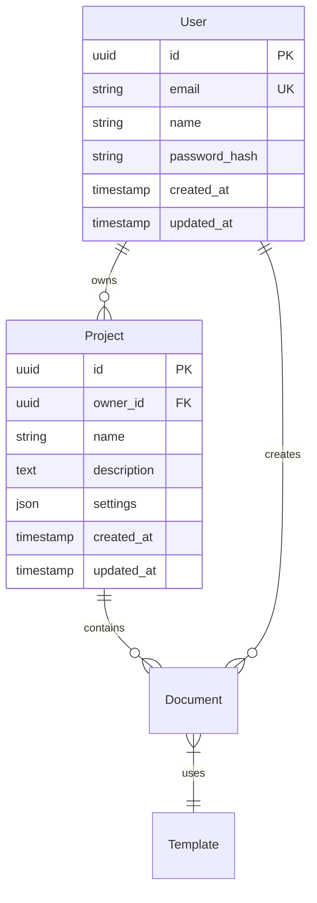

---
metadata:
  id: technical_spec_standard
  name: Technical Specification Template
  description: Comprehensive technical specification template for software projects
  category: specifications
  type: technical_spec
  version: 1.0.0
  author: DevDocAI
  tags: [technical-spec, specifications, architecture, design]
  is_custom: false
  is_active: true
variables:
  - name: project_name
    description: Name of the project
    required: true
    type: string
  - name: version
    description: Version of the specification
    required: true
    type: string
  - name: author_name
    description: Specification author
    required: true
    type: string
  - name: target_audience
    description: Target audience for the specification
    required: false
    type: string
    default: "Development team, architects, stakeholders"
---

# Technical Specification: {{project_name}}

**Version:** {{version}}  
**Author:** {{author_name}}  
**Date:** {{date}}  
**Target Audience:** {{target_audience}}

## 1. Executive Summary

### 1.1 Purpose

This document provides a comprehensive technical specification for {{project_name}}, detailing the system architecture, design decisions, and implementation requirements.

### 1.2 Scope

The specification covers:

- System architecture and components
- Data models and database design  
- API specifications
- Security requirements
- Performance criteria
- Deployment and infrastructure

### 1.3 Overview

{{project_name}} is a [brief description of the system and its primary purpose].

## 2. System Architecture

### 2.1 High-Level Architecture

```
┌─────────────┐    ┌─────────────┐    ┌─────────────┐
│   Frontend  │    │   Backend   │    │  Database   │
│   (React)   │◄──►│  (Node.js)  │◄──►│(PostgreSQL) │
└─────────────┘    └─────────────┘    └─────────────┘
       │                   │                   │
       │                   │                   │
       ▼                   ▼                   ▼
┌─────────────┐    ┌─────────────┐    ┌─────────────┐
│    CDN      │    │   Cache     │    │   Storage   │
│ (CloudFront)│    │   (Redis)   │    │    (S3)     │
└─────────────┘    └─────────────┘    └─────────────┘
```

### 2.2 Component Architecture

#### 2.2.1 Frontend Layer

- **Technology:** React 18+, TypeScript
- **State Management:** Redux Toolkit
- **Routing:** React Router
- **UI Framework:** Material-UI/Chakra UI
- **Build Tool:** Vite

#### 2.2.2 Backend Layer

- **Technology:** Node.js 18+, Express.js
- **Language:** TypeScript
- **Authentication:** JWT with refresh tokens
- **Validation:** Joi/Zod
- **Documentation:** OpenAPI/Swagger

#### 2.2.3 Data Layer

- **Primary Database:** PostgreSQL 14+
- **Cache:** Redis 6+
- **Search:** Elasticsearch (if needed)
- **File Storage:** AWS S3 or compatible

## 3. Data Models

### 3.1 Entity Relationship Diagram



### 3.2 Data Models

#### 3.2.1 User Model

```typescript
interface User {
  id: string;
  email: string;
  name: string;
  passwordHash: string;
  role: UserRole;
  profile?: UserProfile;
  createdAt: Date;
  updatedAt: Date;
}

enum UserRole {
  ADMIN = 'admin',
  USER = 'user',
  GUEST = 'guest'
}
```

#### 3.2.2 Project Model

```typescript
interface Project {
  id: string;
  ownerId: string;
  name: string;
  description?: string;
  settings: ProjectSettings;
  status: ProjectStatus;
  createdAt: Date;
  updatedAt: Date;
}

interface ProjectSettings {
  visibility: 'public' | 'private';
  collaboration: boolean;
  notifications: boolean;
}
```

## 4. API Specification

### 4.1 REST API Design

#### 4.1.1 Base URL

```
Production: https://api.{{project_name}}.com/v1
Staging: https://staging-api.{{project_name}}.com/v1
```

#### 4.1.2 Authentication

All API endpoints require authentication via Bearer token:

```http
Authorization: Bearer <jwt_token>
```

#### 4.1.3 Core Endpoints

**Users**

```
GET    /users           # List users
POST   /users           # Create user
GET    /users/{id}      # Get user details
PUT    /users/{id}      # Update user
DELETE /users/{id}      # Delete user
```

**Projects**

```
GET    /projects        # List user projects
POST   /projects        # Create project
GET    /projects/{id}   # Get project details
PUT    /projects/{id}   # Update project
DELETE /projects/{id}   # Delete project
```

### 4.2 Request/Response Format

#### 4.2.1 Standard Response Format

```json
{
  "success": boolean,
  "data": any,
  "message": string,
  "errors": array,
  "meta": {
    "timestamp": string,
    "version": string,
    "requestId": string
  }
}
```

#### 4.2.2 Error Response Format

```json
{
  "success": false,
  "error": {
    "code": string,
    "message": string,
    "details": object
  },
  "meta": {
    "timestamp": string,
    "requestId": string
  }
}
```

## 5. Security Requirements

### 5.1 Authentication & Authorization

- JWT-based authentication with refresh tokens
- Role-based access control (RBAC)
- Multi-factor authentication (optional)
- Session management and timeout

### 5.2 Data Protection

- Encryption at rest (AES-256)
- Encryption in transit (TLS 1.3)
- PII data anonymization
- Secure data deletion

### 5.3 Security Headers

```http
Content-Security-Policy: default-src 'self'
X-Frame-Options: DENY
X-Content-Type-Options: nosniff
Strict-Transport-Security: max-age=31536000; includeSubDomains
```

## 6. Performance Requirements

### 6.1 Response Time Requirements

- API endpoints: < 200ms (95th percentile)
- Page load time: < 3 seconds
- Database queries: < 100ms average

### 6.2 Throughput Requirements

- Concurrent users: 1000+
- Requests per second: 500+
- Database connections: 100 max

### 6.3 Scalability

- Horizontal scaling capability
- Auto-scaling based on load
- CDN integration for static assets

## 7. Infrastructure & Deployment

### 7.1 Cloud Architecture

```
┌─────────────┐    ┌─────────────┐    ┌─────────────┐
│  Load       │    │ Application │    │  Database   │
│  Balancer   │◄──►│  Servers    │◄──►│  Cluster    │
│  (ALB)      │    │  (ECS/EKS)  │    │   (RDS)     │
└─────────────┘    └─────────────┘    └─────────────┘
```

### 7.2 Technology Stack

- **Cloud Provider:** AWS
- **Container Platform:** Docker + Kubernetes/ECS
- **Database:** Amazon RDS (PostgreSQL)
- **Cache:** Amazon ElastiCache (Redis)
- **CDN:** Amazon CloudFront
- **Monitoring:** CloudWatch, DataDog

### 7.3 Deployment Pipeline

1. **Development** → Git push to feature branch
2. **CI/CD** → Automated tests and builds
3. **Staging** → Deploy to staging environment
4. **Testing** → Automated and manual testing
5. **Production** → Blue-green deployment

## 8. Monitoring & Observability

### 8.1 Logging

- Structured logging (JSON format)
- Log levels: ERROR, WARN, INFO, DEBUG
- Centralized logging with ELK stack
- Log retention: 30 days

### 8.2 Metrics

- Application metrics (response times, error rates)
- Infrastructure metrics (CPU, memory, disk)
- Business metrics (user activity, feature usage)
- Custom dashboards in Grafana

### 8.3 Alerting

- Critical alerts: < 2 minutes response
- Performance alerts: Response time > 5s
- Error rate alerts: Error rate > 5%
- Infrastructure alerts: Resource utilization > 80%

## 9. Testing Strategy

### 9.1 Testing Pyramid

```
    ┌─────────────┐
    │     E2E     │  10%
    ├─────────────┤
    │ Integration │  20%
    ├─────────────┤
    │    Unit     │  70%
    └─────────────┘
```

### 9.2 Test Types

- **Unit Tests:** 90%+ coverage using Jest
- **Integration Tests:** API and database integration
- **E2E Tests:** Critical user journeys using Playwright
- **Performance Tests:** Load and stress testing
- **Security Tests:** OWASP compliance testing

## 10. Migration & Data Strategy

### 10.1 Database Migrations

- Version-controlled migration scripts
- Rollback procedures for each migration
- Data backup before major migrations
- Zero-downtime migration strategies

### 10.2 Data Backup & Recovery

- Daily automated backups
- Point-in-time recovery capability
- Cross-region backup replication
- Recovery time objective (RTO): < 4 hours
- Recovery point objective (RPO): < 1 hour

## 11. Compliance & Regulations

### 11.1 Data Privacy

- GDPR compliance for EU users
- CCPA compliance for California users
- Data portability and deletion rights
- Privacy policy and consent management

### 11.2 Security Standards

- SOC 2 Type II compliance
- OWASP Top 10 vulnerability prevention
- Regular security audits and penetration testing
- Incident response procedures

## 12. Appendices

### Appendix A: Glossary

- **API:** Application Programming Interface
- **JWT:** JSON Web Token
- **RBAC:** Role-Based Access Control
- **CDN:** Content Delivery Network

### Appendix B: References

- [REST API Design Guidelines](https://example.com)
- [Security Best Practices](https://example.com)
- [Performance Optimization Guide](https://example.com)

---

**Document Control:**

- **Version:** {{version}}
- **Last Modified:** {{date}}
- **Next Review:** {{date + 6 months}}
- **Approved By:** {{author_name}}
