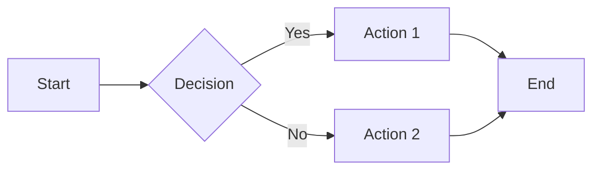

# Documentation Conventions

This guide establishes the documentation standards and conventions for the DevDocAI project.

## Document Structure

### Standard Document Template

```markdown
# Document Title

## Overview
Brief description of the document's purpose and scope.

## Table of Contents
- [Section 1](#section-1)
- [Section 2](#section-2)
- ...

## Main Content
Organized in logical sections with clear headings.

## References
Links to related documents and external resources.

## Revision History
| Date | Version | Author | Changes |
|------|---------|--------|---------|
| YYYY-MM-DD | X.Y.Z | Name | Description |
```

## File Naming Conventions

### Pattern Guidelines

| Type | Pattern | Example |
|------|---------|---------|
| Design Specs | `DESIGN-[module]-[type].md` | `DESIGN-devdocai-architecture.md` |
| Templates | `TEMPLATE-[purpose].md` | `TEMPLATE-release-notes.md` |
| Guides | `[audience]-[topic].md` | `user-manual.md` |
| References | `[topic]-reference.md` | `api-reference.md` |
| Process | `[CAPS-NAME].md` | `CONTRIBUTING.md` |

### Naming Rules

- Use lowercase with hyphens for word separation
- No spaces or special characters except hyphens
- Keep names descriptive but concise
- Include version numbers only when necessary
- Use consistent prefixes for document types

## Writing Style

### General Guidelines

1. **Clarity First**
   - Use simple, direct language
   - Avoid jargon unless necessary
   - Define technical terms on first use
   - Provide examples for complex concepts

2. **Consistency**
   - Use present tense for current features
   - Use future tense for planned features
   - Maintain consistent terminology throughout
   - Follow established patterns

3. **Accessibility**
   - Write for the target audience's knowledge level
   - Use headings to create clear structure
   - Include alt text for images
   - Ensure links are descriptive

### Voice and Tone

- **Professional**: Maintain professional tone throughout
- **Inclusive**: Use inclusive language and examples
- **Direct**: Be concise and to the point
- **Helpful**: Focus on helping the reader understand

## Markdown Standards

### Headings

```markdown
# H1 - Document Title (one per document)
## H2 - Major Sections
### H3 - Subsections
#### H4 - Sub-subsections (avoid if possible)
```

### Code Blocks

Always specify the language for syntax highlighting:

````markdown
```typescript
const example: string = "Use language identifiers";
```

```bash
# Shell commands with $ prefix
$ npm install
```

```yaml
# Configuration files with proper formatting
config:
  key: value
```
````

### Tables

Use tables for structured data:

```markdown
| Column 1 | Column 2 | Column 3 |
|----------|----------|----------|
| Data 1   | Data 2   | Data 3   |
| Data 4   | Data 5   | Data 6   |
```

### Lists

- Use bullets for unordered lists
- Use numbers for sequential steps
- Indent nested lists with 2 spaces
- Keep list items parallel in structure

### Links

```markdown
[Descriptive Link Text](URL)
[Internal Link](../other-doc.md)
[Section Link](#section-heading)
```

## Documentation Types

### Technical Specifications

- Use formal language
- Include all technical details
- Provide diagrams where helpful
- Reference standards and protocols

### User Guides

- Write for end users
- Include step-by-step instructions
- Add screenshots where helpful
- Provide troubleshooting sections

### API Documentation

- Document all endpoints/methods
- Include request/response examples
- Specify error codes and handling
- Note rate limits and constraints

### Developer Guides

- Focus on implementation details
- Include code examples
- Explain design decisions
- Provide debugging tips

## Diagrams and Visuals

### When to Use Diagrams

- Architecture overviews
- Data flow illustrations
- Process workflows
- Complex relationships

### Diagram Standards

- Use Mermaid for version-controlled diagrams
- Keep diagrams simple and focused
- Include legends for symbols
- Ensure text is readable

### Example Mermaid Diagram



## Version Control

### Commit Messages for Docs

```
docs: [type] brief description

- Detailed change 1
- Detailed change 2

Refs: #issue-number
```

Types:

- `add`: New documentation
- `update`: Update existing docs
- `fix`: Fix errors or typos
- `refactor`: Restructure documentation
- `archive`: Move to archives

### Documentation Reviews

All documentation should be reviewed for:

- Technical accuracy
- Completeness
- Clarity and readability
- Consistency with conventions
- Proper formatting

## Cross-References

### Internal References

- Use relative paths for internal links
- Maintain link integrity when moving files
- Update references when archiving documents
- Include section anchors for deep linking

### External References

- Verify external links remain valid
- Include access dates for web resources
- Archive important external content
- Note version dependencies

## Metadata

### Required Metadata

Each document should include:

```yaml
---
title: Document Title
type: specification|guide|reference|template
version: X.Y.Z
date: YYYY-MM-DD
author: Name
status: draft|review|approved|deprecated
---
```

### Optional Metadata

- `tags`: For categorization
- `related`: Links to related docs
- `supersedes`: Previous version
- `audience`: Target readers

## Quality Checklist

Before publishing documentation:

- [ ] Follows naming conventions
- [ ] Includes required metadata
- [ ] Has clear structure with headings
- [ ] Uses consistent formatting
- [ ] Code blocks have language tags
- [ ] Links are working
- [ ] Reviewed for accuracy
- [ ] Spell-checked
- [ ] Accessible language used
- [ ] Examples provided where needed

## Maintenance

### Regular Reviews

- Quarterly accuracy reviews
- Link validation checks
- Consistency audits
- User feedback integration

### Update Triggers

- Feature releases
- API changes
- Bug fixes affecting behavior
- User feedback
- Security updates

## Tools and Resources

### Recommended Tools

- **Markdown Editor**: VS Code with Markdown extensions
- **Spell Checker**: CSpell or similar
- **Link Checker**: markdown-link-check
- **Formatter**: Prettier for Markdown
- **Diagrams**: Mermaid, PlantUML

### Templates

Find document templates in `/docs/00-meta/templates/`

### Style References

- [Google Developer Documentation Style Guide](https://developers.google.com/style)
- [Microsoft Writing Style Guide](https://docs.microsoft.com/style-guide)
- [Write the Docs](https://www.writethedocs.org)
