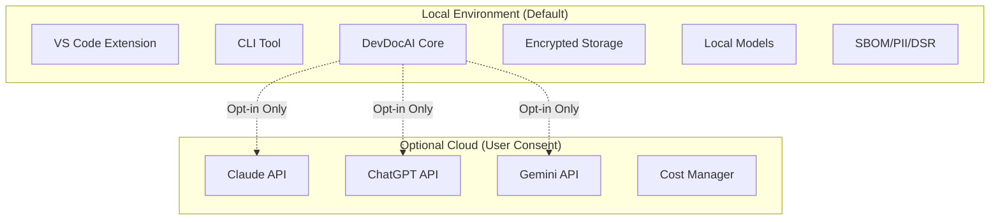

# Software Requirements Specification

## DevDocAI v3.6.0

---
🎯 **STATUS: IMPLEMENTATION BLUEPRINT FOR DevDocAI v3.0.0** 🎯

**Document Type**: Implementation Blueprint
**Target Build**: DevDocAI v3.0.0 (Clean Development Branch)
**Design Suite Version**: v3.6.0
**Purpose**: Technical guide for v3.0.0 development

> **This document provides the complete technical specifications for building DevDocAI v3.0.0.**
> All code examples, commands, and installation instructions are implementation requirements for the clean development branch.

---

🏗️ **IMPLEMENTATION GUIDANCE**

This document contains complete technical specifications ready for immediate implementation.
Use this as the authoritative blueprint to build DevDocAI v3.0.0 following strict design compliance.

---

**Document Version:** 3.6.0
**Date:** August 23, 2025
**Status:** FINAL - Test Coverage & Human Verification Enhanced
**License:** Apache-2.0 (Core), MIT (Plugin SDK)

**Document Alignment Status:**

- ✅ User Stories v3.5.0 - All 21 stories (US-001 through US-021) mapped
- ✅ PRD v3.5.0 - Complete consistency with all requirements
- ✅ Architecture v3.5.0 - All components (M001-M013) integrated
- ✅ Technical Alignment Complete
- ✅ Test Coverage Enhanced - 100% mandatory coverage implemented
- ✅ Human Verification - Gates and HITL processes defined

---

## Table of Contents

- [Software Requirements Specification](#software-requirements-specification)
  - [DevDocAI v3.6.0](#devdocai-v360)
  - [Table of Contents](#table-of-contents)
  - [1. Introduction](#1-introduction)
    - [1.1 Purpose](#11-purpose)
    - [1.2 Scope](#12-scope)
    - [1.3 Definitions and Acronyms](#13-definitions-and-acronyms)
    - [1.4 References](#14-references)
    - [1.5 Overview](#15-overview)
  - [2. Overall Description](#2-overall-description)
    - [2.1 Product Perspective](#21-product-perspective)
      - [2.1.1 System Context](#211-system-context)
    - [2.2 Product Functions](#22-product-functions)
    - [2.3 User Characteristics](#23-user-characteristics)
    - [2.4 Constraints](#24-constraints)
      - [2.4.1 Regulatory Constraints](#241-regulatory-constraints)
      - [2.4.2 Technical Constraints](#242-technical-constraints)
    - [2.5 Assumptions and Dependencies](#25-assumptions-and-dependencies)
      - [2.5.1 Assumptions (Converted to Requirements)](#251-assumptions-converted-to-requirements)
      - [2.5.2 Dependencies](#252-dependencies)
  - [3. Specific Requirements](#3-specific-requirements)
    - [3.1 Functional Requirements](#31-functional-requirements)
      - [3.1.1 Document Generation Requirements](#311-document-generation-requirements)
      - [3.1.2 Document Analysis Requirements](#312-document-analysis-requirements)
      - [3.1.3 Suite Management Requirements](#313-suite-management-requirements)
      - [3.1.4 Enhancement Requirements](#314-enhancement-requirements)
      - [3.1.5 Security Requirements](#315-security-requirements)
      - [3.1.6 Privacy Requirements](#316-privacy-requirements)
      - [3.1.7 Cost Management Requirements](#317-cost-management-requirements)
      - [3.1.8 Compliance Requirements](#318-compliance-requirements)
    - [3.2 Non-Functional Requirements](#32-non-functional-requirements)
      - [3.2.1 Performance Requirements](#321-performance-requirements)
      - [3.2.2 Scalability Requirements](#322-scalability-requirements)
      - [3.2.3 Reliability Requirements](#323-reliability-requirements)
      - [3.2.4 Usability Requirements](#324-usability-requirements)
      - [3.2.5 Security Requirements](#325-security-requirements)
      - [3.2.6 Maintainability Requirements](#326-maintainability-requirements)
      - [3.2.7 Portability Requirements](#327-portability-requirements)
      - [3.2.8 Reusability Requirements](#328-reusability-requirements)
      - [3.2.9 Flexibility Requirements](#329-flexibility-requirements)
    - [3.3 Quality Metrics Definitions](#33-quality-metrics-definitions)
      - [3.3.1 Quality Score Calculation](#331-quality-score-calculation)
      - [3.3.2 Performance Metrics](#332-performance-metrics)
    - [3.4 External Interface Requirements](#34-external-interface-requirements)
      - [3.4.1 User Interfaces](#341-user-interfaces)
      - [3.4.2 Software Interfaces](#342-software-interfaces)
    - [3.5 Design Constraints](#35-design-constraints)
      - [3.5.1 Standards Compliance](#351-standards-compliance)
      - [3.5.2 Implementation Constraints](#352-implementation-constraints)
  - [4. Performance Requirements](#4-performance-requirements)
    - [4.1 Response Time Requirements](#41-response-time-requirements)
    - [4.2 Throughput Requirements](#42-throughput-requirements)
    - [4.3 Resource Utilization](#43-resource-utilization)
      - [4.3.1 Memory Modes (Aligned with PRD)](#431-memory-modes-aligned-with-prd)
    - [4.4 Scalability Requirements](#44-scalability-requirements)
  - [5. Security Requirements](#5-security-requirements)
    - [5.1 Authentication and Authorization](#51-authentication-and-authorization)
    - [5.2 Data Protection](#52-data-protection)
    - [5.3 Security Analysis](#53-security-analysis)
    - [5.4 Privacy Requirements](#54-privacy-requirements)
    - [5.5 Audit and Compliance](#55-audit-and-compliance)
  - [6. Accessibility Requirements](#6-accessibility-requirements)
    - [6.1 WCAG 2.1 Compliance](#61-wcag-21-compliance)
    - [6.2 Accessibility Testing Coverage](#62-accessibility-testing-coverage)
  - [7. User Interface Requirements](#7-user-interface-requirements)
    - [7.1 VS Code Extension Interface](#71-vs-code-extension-interface)
    - [7.2 Command Line Interface](#72-command-line-interface)
    - [7.3 Documentation Health Dashboard](#73-documentation-health-dashboard)
  - [8. System Requirements](#8-system-requirements)
    - [8.1 Hardware Requirements](#81-hardware-requirements)
      - [8.1.1 Minimum Requirements (Realistic Baseline)](#811-minimum-requirements-realistic-baseline)
      - [8.1.2 Recommended Requirements](#812-recommended-requirements)
    - [8.2 Software Requirements](#82-software-requirements)
      - [8.2.1 Operating Systems](#821-operating-systems)
      - [8.2.2 Dependencies with Versions](#822-dependencies-with-versions)
    - [8.3 Network Requirements](#83-network-requirements)
  - [9. Implementation Timeline](#9-implementation-timeline)
    - [9.1 Development Phases](#91-development-phases)
      - [Phase 1: Core Foundation (Months 1-3)](#phase-1-core-foundation-months-1-3)
      - [Phase 2: Intelligence Layer (Months 4-6)](#phase-2-intelligence-layer-months-4-6)
      - [Phase 3: Suite Management (Months 7-9)](#phase-3-suite-management-months-7-9)
      - [Phase 4: User Experience (Months 10-11)](#phase-4-user-experience-months-10-11)
      - [Phase 5: Compliance \& Security (Months 12-14)](#phase-5-compliance--security-months-12-14)
      - [Phase 6: Polish \& Release (Months 15-16)](#phase-6-polish--release-months-15-16)
    - [9.2 Change Management Process](#92-change-management-process)
      - [9.2.1 Requirement Change Control](#921-requirement-change-control)
      - [9.2.2 Version Control](#922-version-control)
    - [9.3 Success Metrics](#93-success-metrics)
  - [10. Testing Requirements](#10-testing-requirements)
    - [10.1 Test Coverage Requirements](#101-test-coverage-requirements)
    - [10.2 Test Types](#102-test-types)
      - [10.2.1 Functional Testing](#1021-functional-testing)
      - [10.2.2 Non-Functional Testing](#1022-non-functional-testing)
      - [10.2.3 Compliance Testing](#1023-compliance-testing)
    - [10.3 Requirements to Test Traceability](#103-requirements-to-test-traceability)
    - [10.4 Human-in-the-Loop Testing](#104-human-in-the-loop-testing)
      - [10.4.1 Verification Points](#1041-verification-points)
      - [10.4.2 Golden Path Scenarios](#1042-golden-path-scenarios)
      - [10.4.3 Human Validation Metrics](#1043-human-validation-metrics)
      - [10.4.4 Continuous Improvement Process](#1044-continuous-improvement-process)
  - [11. Appendices](#11-appendices)
    - [A. API Specifications](#a-api-specifications)
      - [A.1 REST API Endpoints](#a1-rest-api-endpoints)
    - [B. Data Models](#b-data-models)
      - [B.1 Core Models](#b1-core-models)
    - [C. Error Codes](#c-error-codes)
      - [C.1 Error Code Structure with Operational Mitigation](#c1-error-code-structure-with-operational-mitigation)
      - [C.2 Emergency Recovery Procedures](#c2-emergency-recovery-procedures)
    - [D. Complete Traceability Matrix](#d-complete-traceability-matrix)
      - [D.1 Requirements to User Stories to Test Cases](#d1-requirements-to-user-stories-to-test-cases)
      - [D.2 Component Coverage](#d2-component-coverage)

---

## 1. Introduction

### 1.1 Purpose

This Software Requirements Specification (SRS) defines the functional and non-functional requirements for DevDocAI v3.6.0, an AI-powered documentation generation and management system for solo developers and small teams. This document serves as the authoritative technical specification for development, testing, and validation activities.

**Target Audiences:**

- Development team members implementing features
- Quality assurance engineers validating behavior
- Technical stakeholders evaluating compliance
- System integrators and deployment teams

### 1.2 Scope

DevDocAI v3.6.0 SHALL be an open-source documentation system that empowers developers to create, analyze, and maintain professional-grade technical documentation with enterprise-level compliance features using AI-powered generation and enhancement.

**In Scope:**

- Automated document generation from 40+ templates
- Multi-dimensional document analysis with quality scoring
- Cross-document consistency management
- AI-powered enhancement using MIAIR methodology
- VS Code extension and CLI interfaces
- Privacy-first architecture with local operation
- Plugin architecture with sandboxing
- WCAG 2.1 Level AA accessibility compliance
- SBOM generation (SPDX 2.3, CycloneDX 1.4)
- PII detection (≥95% accuracy)
- DSR implementation (GDPR/CCPA)
- Cost management with provider optimization

**Out of Scope (Rationale Provided):**

- Real-time collaborative editing (focus on solo developers)
- Version control implementation (leverages existing Git)
- Cloud hosting services (privacy-first approach)
- Mobile applications (desktop-focused workflows)
- Voice interfaces (professional documentation focus)
- Translation services (English-first implementation)

### 1.3 Definitions and Acronyms

| Term | Definition |
|------|------------|
| **Coherence Index** | Metric measuring logical flow (0-1 scale, target ≥0.94) |
| **DSR** | Data Subject Rights (GDPR Articles 15-22) |
| **Entropy Score** | Information density measure (0-1 scale, target <0.15) |
| **MIAIR** | Meta-Iterative AI Refinement methodology |
| **Quality Gate** | Minimum threshold set at exactly 85% |
| **Quality Score** | Composite metric (0-100) = 0.35×Entropy + 0.35×Coherence + 0.30×Completeness |
| **SBOM** | Software Bill of Materials per SPDX 2.3 / CycloneDX 1.4 |

### 1.4 References

1. IEEE Std 830-1998: Software Requirements Specifications
2. WCAG 2.1: Web Content Accessibility Guidelines
3. ISO/IEC 25010:2011: Quality Requirements and Evaluation
4. OWASP ASVS v4.0.3: Application Security Verification
5. NIST SP 800-88: Guidelines for Media Sanitization
6. GDPR Articles 15-22: Data Subject Rights
7. CCPA Title 1.81.5: California Consumer Privacy Act

### 1.5 Overview

This document follows IEEE 830 standard enhanced for modern practices. Section 2 provides product context aligned with PRD v3.5.0. Section 3 details requirements traceable to all 21 user stories. Sections 4-8 specify measurable quality attributes. Section 9 outlines implementation with change management. Section 10 defines comprehensive testing. Appendices provide technical specifications and complete traceability.

---

## 2. Overall Description

### 2.1 Product Perspective

#### 2.1.1 System Context

DevDocAI SHALL operate as a standalone application with selective cloud integration, following a privacy-first architecture where core functionality runs locally with optional cloud enhancement for LLM capabilities.

**Local vs. Cloud Trade-offs:**

- **Local Operation**: Full privacy, no data transmission, limited to local models
- **Cloud Enhancement**: Advanced AI capabilities, cost tracking, requires API keys



### 2.2 Product Functions

High-level capabilities mapped to user stories:

1. **Document Generation** (US-001, US-003): Template-based and AI-enhanced creation
2. **Document Analysis** (US-004, US-005, US-006): Multi-dimensional quality assessment
3. **Suite Management** (US-002, US-007, US-008): Relationship tracking and consistency
4. **AI Enhancement** (US-009): MIAIR-based quality improvement
5. **Security & Privacy** (US-010, US-017): Local-first with encryption
6. **Integration** (US-012, US-013): VS Code and CLI interfaces
7. **Reporting** (US-014, US-015): Dashboard and learning system
8. **Extensibility** (US-016): Secure plugin architecture
9. **Compliance** (US-019, US-020, US-021): SBOM, PII, DSR features

### 2.3 User Characteristics

| User Type | Expertise | Primary Need |
|-----------|-----------|--------------|
| Solo Developers | High technical, limited documentation | Quick, quality documentation |
| Open Source Maintainers | Advanced programming | Compliance documentation |
| Technical Writers | Expert documentation | AI-assisted writing |
| Compliance Officers | Regulatory knowledge | SBOM, PII, DSR management |

### 2.4 Constraints

#### 2.4.1 Regulatory Constraints

- GDPR compliance for EU users
- CCPA compliance for California users
- EU Cyber Resilience Act (SBOM requirements)
- US Executive Order 14028 (Software supply chain)

#### 2.4.2 Technical Constraints

- Memory modes: Baseline (3-4GB), Standard (4-6GB), Enhanced (6-8GB), Performance (>8GB)
- Local model size: 2-5GB disk space
- API rate limits per provider

### 2.5 Assumptions and Dependencies

#### 2.5.1 Assumptions (Converted to Requirements)

- Users SHALL have basic command-line familiarity OR use VS Code extension
- System SHALL provide training documentation for compliance features
- System SHALL include setup wizards for first-time users

#### 2.5.2 Dependencies

- LLM provider API stability (mitigated by multi-provider support)
- Node.js 18.0+ and Python 3.9+ ecosystems
- VS Code extension API v1.70+
- Git 2.25+ for version control features

---

## 3. Specific Requirements

### 3.1 Functional Requirements

#### 3.1.1 Document Generation Requirements

**FR-001**: Template-Based Generation [Priority: High] [US-001]

- The system SHALL provide 40+ document templates organized by category
- The system SHALL validate template syntax before generation
- The system SHALL support custom template creation
- **Acceptance Criteria**: 100% of templates produce valid documents
- **Test Case**: TC-001

**FR-002**: Multi-LLM Synthesis [Priority: High] [US-001, AC-001.2]

- The system SHALL integrate Claude (40%), ChatGPT (35%), Gemini (25%) with configurable weights
- The system SHALL implement automatic fallback on API failure
- The system SHALL sanitize data before external transmission
- **Acceptance Criteria**: Fallback completes within 2 seconds
- **Test Case**: TC-002

**FR-003**: Suite Generation [Priority: High] [US-003]

- The system SHALL generate complete documentation suites atomically
- The system SHALL establish cross-references automatically
- The system SHALL preserve existing documents with versioning
- **Acceptance Criteria**: Suite generation maintains 100% referential integrity
- **Test Case**: TC-003

#### 3.1.2 Document Analysis Requirements

**FR-005**: Quality Assessment [Priority: High] [US-004]

- The system SHALL calculate quality scores using the formula: Q = 0.35×E + 0.35×C + 0.30×R
- The system SHALL enforce Quality Gate at exactly 85%
- The system SHALL provide actionable recommendations with priority levels
- **Acceptance Criteria**: Score calculation accuracy ±1%
- **Test Case**: TC-005

**FR-006**: Requirements Validation [Priority: High] [US-005]

- The system SHALL detect ambiguous language with <10% false positives
- The system SHALL verify testability using RFC 2119 keywords
- The system SHALL identify conflicts with conflict resolution suggestions
- **Acceptance Criteria**: 95% detection rate for known ambiguities
- **Test Case**: TC-006

#### 3.1.3 Suite Management Requirements

**FR-008**: Tracking Matrix [Priority: High] [US-002, M005]

- The system SHALL display relationships with directional arrows
- The system SHALL update visualizations within 500ms of changes
- The system SHALL use color coding: green (>90%), yellow (70-90%), red (<70%)
- **Acceptance Criteria**: Matrix handles 1000+ documents
- **Test Case**: TC-008

**FR-010**: Impact Analysis [Priority: Medium] [US-008, M006]

- The system SHALL identify affected documents with dependency depth
- The system SHALL estimate effort within ±20% accuracy
- The system SHALL detect circular dependencies with resolution paths
- **Acceptance Criteria**: 95% accuracy for direct dependencies
- **Test Case**: TC-010

#### 3.1.4 Enhancement Requirements

**FR-011**: MIAIR Enhancement [Priority: High] [US-009, M003]

- The system SHALL achieve 60-75% entropy reduction
- The system SHALL maintain coherence index ≥0.94
- The system SHALL mark AI-generated content with metadata
- **Acceptance Criteria**: Enhancement completes within 45 seconds
- **Test Case**: TC-011

#### 3.1.5 Security Requirements

**FR-013**: Security Scanning [Priority: High] [US-010]

- The system SHALL detect exposed credentials with 0% false negatives
- The system SHALL rank findings using CVSS v3.1 scoring
- The system SHALL reference OWASP Top 10 for web applications
- **Acceptance Criteria**: Scan completes within 15 seconds
- **Test Case**: TC-013

#### 3.1.6 Privacy Requirements

**FR-023**: Data Control [Priority: High] [US-017]

- The system SHALL operate fully offline when configured
- The system SHALL encrypt API keys using AES-256-GCM per NIST guidelines
- The system SHALL provide cryptographic erasure per NIST SP 800-88
- **Acceptance Criteria**: Zero network calls in offline mode
- **Test Case**: TC-023

#### 3.1.7 Cost Management Requirements

**FR-025**: API Cost Tracking [Priority: High] [REQ-044, M008]

- The system SHALL enforce daily limits (default: $10.00) with ±$0.01 accuracy
- The system SHALL route to providers using cost/quality ratio optimization
- The system SHALL warn at 80% threshold with projected overage time
- **Acceptance Criteria**: Cost tracking accuracy 99.9%
- **Test Case**: TC-025

#### 3.1.8 Compliance Requirements

**FR-027**: SBOM Generation [Priority: High] [US-019, M010]

- The system SHALL generate SPDX 2.3 and CycloneDX 1.4 formats
- The system SHALL achieve 100% dependency coverage
- The system SHALL complete generation within 30 seconds for <500 dependencies
- **Acceptance Criteria**: SBOM validates against official schemas
- **Test Case**: TC-027

**FR-028**: PII Detection [Priority: High] [US-020]

- The system SHALL detect PII with ≥95% accuracy (F1 score ≥0.95)
- The system SHALL process at ≥1000 words/second
- The system SHALL support GDPR and CCPA pattern sets
- **Acceptance Criteria**: False positive rate <5%, False negative rate <5%
- **Test Case**: TC-028

**FR-029**: Data Subject Rights [Priority: High] [US-021]

- The system SHALL process DSR requests within 24 hours automated
- The system SHALL generate cryptographic deletion certificates
- The system SHALL maintain tamper-evident audit logs using HMAC-SHA256
- **Acceptance Criteria**: 100% GDPR Article 15-22 compliance
- **Test Case**: TC-029

**FR-030**: Human Verification Interface [Priority: High] [NEW]

- The system SHALL provide visual dashboards displaying analysis results in human-reviewable format
- The system SHALL generate Portable Document Format (PDF) reports suitable for offline validation and audit documentation
- The system SHALL highlight areas requiring human attention with visual indicators (red/yellow/green)
- The system SHALL track human verification completion status with timestamps and reviewer identification
- The system SHALL prevent progression to next phase until human verification is documented
- **Acceptance Criteria**: 100% of critical outputs must be reviewable by humans with exportable evidence
- **Test Case**: TC-030 - Verify dashboard generation, PDF export, tracking functionality
- **Traceability**: Supports quality assurance and compliance requirements across all user stories

### 3.2 Non-Functional Requirements

#### 3.2.1 Performance Requirements

**NFR-001**: Response Time [Priority: High]

- VS Code suggestions SHALL appear within 500ms (95th percentile)
- Document analysis SHALL complete within 10 seconds (single document)
- Matrix updates SHALL render within 500ms (target), 1 second (maximum)
- **Acceptance**: 95% of operations meet target, 100% meet maximum

**NFR-002**: Throughput [Priority: Medium]

- The system SHALL process 100 documents/hour (minimum)
- The system SHALL support 50 concurrent operations
- The system SHALL handle 1000 documents in tracking matrix

#### 3.2.2 Scalability Requirements

**NFR-003**: Horizontal Scalability [Priority: Medium]

- The system SHALL support distributed processing for batch operations
- The system SHALL scale linearly up to 10 concurrent workers
- The system SHALL maintain consistency across distributed operations

**NFR-004**: Vertical Scalability [Priority: Medium]

- The system SHALL utilize available RAM up to configured limits
- The system SHALL adapt algorithms based on memory mode
- The system SHALL provide graceful degradation under resource constraints

#### 3.2.3 Reliability Requirements

**NFR-005**: Availability [Priority: High]

- Core features SHALL maintain 99.9% availability
- The system SHALL recover from crashes within 30 seconds
- The system SHALL preserve work with journaling

**NFR-006**: Fault Tolerance [Priority: High]

- The system SHALL handle API failures with local fallback
- The system SHALL validate all inputs to prevent crashes
- The system SHALL isolate plugin failures from core

#### 3.2.4 Usability Requirements

**NFR-007**: Learnability [Priority: High]

- New users SHALL generate first document within 5 minutes
- The system SHALL provide contextual help for all features
- Error messages SHALL include resolution steps

**NFR-008**: Efficiency [Priority: Medium]

- Common operations SHALL require ≤3 user actions
- The system SHALL remember user preferences
- Batch operations SHALL be scriptable

#### 3.2.5 Security Requirements

**NFR-009**: Data Protection [Priority: High]

- The system SHALL encrypt data at rest using AES-256-GCM
- The system SHALL sanitize logs to exclude sensitive data
- The system SHALL implement secure deletion (3-pass overwrite)

**NFR-010**: Access Control [Priority: Medium]

- The system SHALL enforce plugin permissions per manifest
- The system SHALL validate all file access against OS permissions
- The system SHALL maintain audit logs for security events

#### 3.2.6 Maintainability Requirements

**NFR-011**: Modularity [Priority: High]

- Components SHALL have single responsibilities
- The system SHALL maintain <10% coupling between modules
- Code coverage SHALL meet: 80% overall, 90% critical, 100% security

**NFR-012**: Extensibility [Priority: Medium]

- Plugin API SHALL remain backward compatible (semantic versioning)
- The system SHALL support custom analyzers via standard interfaces
- Configuration SHALL be extensible without code changes

#### 3.2.7 Portability Requirements

**NFR-013**: Platform Independence [Priority: High]

- The system SHALL run on Windows 10+, macOS 10.14+, Ubuntu 20.04+
- The system SHALL use platform-agnostic paths
- Dependencies SHALL be available for all platforms

#### 3.2.8 Reusability Requirements

**NFR-014**: Component Reusability [Priority: Medium]

- Core modules SHALL be usable as standalone libraries
- Templates SHALL be shareable across projects
- Analyzers SHALL be composable for custom workflows

**NFR-015**: Configuration Reusability [Priority: Low]

- Settings SHALL be exportable/importable
- Learned patterns SHALL be shareable
- Plugin configurations SHALL be templatable

#### 3.2.9 Flexibility Requirements

**NFR-016**: Adaptability [Priority: Medium]

- The system SHALL support custom document types via plugins
- The system SHALL allow quality metric customization
- The system SHALL enable workflow automation via scripts

### 3.3 Quality Metrics Definitions

#### 3.3.1 Quality Score Calculation

**Formula**: Q(d) = 0.35 × E(d) + 0.35 × C(d) + 0.30 × R(d)

Where:

- E(d) = Entropy Score (0-1, normalized to 0-100)
- C(d) = Coherence Index (0-1, normalized to 0-100)
- R(d) = Completeness Rating (0-100)

**Measurement**: Calculate per document, cache for 1 hour
**Threshold**: Exactly 85% for quality gate pass

#### 3.3.2 Performance Metrics

| Metric | Target | Measurement Method |
|--------|--------|-------------------|
| Response Time (P95) | <500ms | Instrumentation logging |
| Throughput | 100 docs/hour | Performance counters |
| Memory Efficiency | Per mode limits | Resource monitoring |
| API Cost Accuracy | 99.9% | Transaction reconciliation |

### 3.4 External Interface Requirements

#### 3.4.1 User Interfaces

**UI-001**: VS Code Extension

- Tree view with health indicators (color-coded)
- Inline suggestions (non-blocking overlays)
- Context menus (right-click actions)
- Status bar metrics (quality score, word count)
- All features SHALL comply with WCAG 2.1 Level AA

**UI-002**: Command Line Interface

- POSIX-compliant syntax
- JSON output for automation (--format=json)
- Progress indicators for operations >1 second
- Exit codes: 0 (success), 1 (error), 2 (warning)

**UI-003**: Documentation Dashboard

- Responsive breakpoints: mobile (<768px), tablet (768-1024px), desktop (>1024px)
- Progressive enhancement for slow connections
- Keyboard navigation (Tab, Arrow keys, Enter, Escape)
- Screen reader compatibility (ARIA labels)

#### 3.4.2 Software Interfaces

**SI-001**: LLM Provider APIs

- Claude API v1 with Anthropic SDK
- OpenAI API v1 with official client
- Google AI API v1 with Gemini SDK
- Timeout: 30 seconds with exponential backoff

**SI-002**: Compliance APIs

- SPDX validation service (<https://tools.spdx.org/app/validate/>)
- CVE database API (<https://nvd.nist.gov/developers/vulnerabilities>)
- License database (<https://spdx.org/licenses/>)

### 3.5 Design Constraints

#### 3.5.1 Standards Compliance

- IEEE 830-1998 for requirements
- ISO/IEC 25010 for quality model
- RFC 2119 for requirement keywords
- Semantic Versioning 2.0.0
- OpenAPI 3.0 for API specifications

#### 3.5.2 Implementation Constraints

- TypeScript for VS Code extension
- Python 3.9+ for core engine
- Node.js 18+ for CLI
- Maximum 100MB extension size

---

## 4. Performance Requirements

### 4.1 Response Time Requirements

| Operation | Target (P95) | Maximum | Conditions |
|-----------|-------------|---------|------------|
| VS Code suggestion | 500ms | 1s | From keystroke |
| Document analysis | 10s | 30s | <100KB document |
| Suite analysis | 90s | 150s | 20 documents |
| SBOM generation | 30s | 60s | <500 dependencies |
| PII detection | 5s | 10s | 10 pages |

**Note**: Targets align with PRD Table 11 performance specifications.

### 4.2 Throughput Requirements

| Operation | Minimum | Target | Peak |
|-----------|---------|--------|------|
| Document processing | 100/hour | 500/hour | 1000/hour |
| Concurrent analysis | 10 | 50 | 100 |
| API requests | 10/min | 60/min | 100/min |

### 4.3 Resource Utilization

#### 4.3.1 Memory Modes (Aligned with PRD)

| Mode | RAM | Features | Performance |
|------|-----|----------|-------------|
| Baseline | 3-4GB | Templates, basic analysis, no AI | Basic |
| Standard | 4-6GB | Full features with cloud AI | Normal |
| Enhanced | 6-8GB | Local LLMs, heavy caching | 2x faster |
| Performance | >8GB | All features, max optimization | Maximum |

**Note**: Baseline mode supports template generation and basic analysis only. AI enhancement, local LLMs, and advanced caching require Standard mode or higher.

### 4.4 Scalability Requirements

The system SHALL scale to handle:

- 10,000+ documents per project
- 1,000+ concurrent VS Code instances
- 100+ plugins loaded simultaneously
- 50+ LLM requests per minute

---

## 5. Security Requirements

### 5.1 Authentication and Authorization

**SEC-001**: Plugin Authorization

- Plugins SHALL declare permissions in manifest
- Permissions SHALL be granted explicitly by user
- The system SHALL enforce least privilege principle
- Revoked plugins SHALL be disabled immediately

### 5.2 Data Protection

**SEC-002**: Encryption Standards

- Data at rest: AES-256-GCM per FIPS 140-2
- Key derivation: Argon2id with 64MB memory cost
- API keys: Stored in OS keychain when available
- Transport: TLS 1.3 minimum

### 5.3 Security Analysis

**SEC-003**: Vulnerability Detection

- The system SHALL scan using OWASP dependency check
- The system SHALL update vulnerability database weekly
- The system SHALL alert on CVSS score ≥7.0
- The system SHALL provide remediation guidance

### 5.4 Privacy Requirements

**SEC-004**: Data Minimization

- The system SHALL collect only essential metadata
- The system SHALL anonymize telemetry data
- The system SHALL provide opt-out for all analytics
- The system SHALL delete temporary files within 24 hours

### 5.5 Audit and Compliance

**SEC-005**: Security Logging

- The system SHALL log authentication attempts
- The system SHALL log permission changes
- The system SHALL protect logs with HMAC-SHA256
- The system SHALL rotate logs at 100MB

---

## 6. Accessibility Requirements

### 6.1 WCAG 2.1 Compliance

The system SHALL meet WCAG 2.1 Level AA criteria:

- **Perceivable**: Alt text, captions, contrast ratios (4.5:1 normal, 3:1 large)
- **Operable**: Keyboard navigation, skip links, focus indicators
- **Understandable**: Clear labels, error identification, consistent navigation
- **Robust**: Valid HTML, ARIA labels, screen reader compatibility

### 6.2 Accessibility Testing Coverage

**ACC-001**: Testing Requirements

- 100% of interactive elements SHALL be keyboard accessible
- 100% of forms SHALL have proper labels
- 100% of images SHALL have alt text
- 100% of color information SHALL have alternatives
- Testing SHALL use NVDA, JAWS, and VoiceOver

---

## 7. User Interface Requirements

### 7.1 VS Code Extension Interface

The extension SHALL provide:

- Document explorer with health indicators
- Real-time analysis overlays
- Quick fix suggestions
- Integrated terminal commands
- Accessibility compliance per Section 6

### 7.2 Command Line Interface

The CLI SHALL support:

- Command completion (bash, zsh, PowerShell)
- Colorized output with --no-color option
- Machine-readable formats (JavaScript Object Notation (JSON), Comma-Separated Values (CSV), Extensible Markup Language (XML))
- Batch processing with glob patterns
- Pipeline integration (stdin/stdout)

### 7.3 Documentation Health Dashboard

The dashboard SHALL display:

- Overall health score (prominent, top-center)
- Document grid with visual indicators
- Trend charts (30-day default, configurable)
- Progressive disclosure (summary → detail)
- Export options (PDF, HTML, JSON)

---

## 8. System Requirements

### 8.1 Hardware Requirements

#### 8.1.1 Minimum Requirements (Realistic Baseline)

- Processor: Dual-core 2.0 GHz x64
- RAM: 3GB absolute minimum (4GB recommended for Baseline Mode)
- Storage: 5GB available (plus OS requirements)
- Display: 1280×720
- Network: 1 Mbps for cloud features (optional)

**Baseline Mode Capabilities (3-4GB RAM):**

- ✅ Template-based document generation
- ✅ Basic quality analysis and scoring
- ✅ Local storage and encryption
- ✅ VS Code extension and CLI
- ❌ AI enhancement features
- ❌ Local LLM models
- ❌ Advanced caching
- ❌ Concurrent heavy operations

#### 8.1.2 Recommended Requirements

- Processor: Quad-core 2.5 GHz x64
- RAM: 8GB+ (Performance Mode)
- Storage: 10GB available
- Display: 1920×1080
- Network: 10 Mbps broadband

### 8.2 Software Requirements

#### 8.2.1 Operating Systems

- Windows 10 version 1909+ (64-bit)
- macOS 10.14 Mojave+
- Ubuntu 20.04 LTS+
- RHEL 8+, Debian 10+

#### 8.2.2 Dependencies with Versions

- Node.js 18.0.0+
- Python 3.9.0+
- Git 2.25.0+
- VS Code 1.70.0+
- Argon2 1.0.0+ (for key derivation)
- OpenSSL 1.1.1+ (for encryption)

### 8.3 Network Requirements

- HTTPS (port 443) for API access
- WebSocket for real-time updates
- SSH (port 22) for Git operations
- Proxy support via environment variables

---

## 9. Implementation Timeline

### 9.1 Development Phases

#### Phase 1: Core Foundation (Months 1-3)

**Milestones with Measurable Criteria:**

- M1.1: Repository and CI/CD (100% test automation)
- M1.2: Basic generation for 5 types (100% template coverage)
- M1.3: Quality analysis engine (85% gate functional)
- M1.4: VS Code extension MVP (Load time <2s)
- M1.5: CLI framework (All basic commands)
- **Success**: Generate documents with 85% quality score

**Phase 1 Human Verification Gate:**

- **Mandatory Review Requirements**: Architecture review, code quality audit, security baseline validation
- **Required Approvals**: Technical Lead, QA Lead, Security Officer (3/3 required)
- **Evidence Requirements**:
  - 100% unit test coverage report with manual verification
  - Architecture compliance checklist with sign-offs
  - Security scan results with human-validated remediation
  - Performance benchmarks meeting baseline requirements
- **Sign-off Process**: Each approver SHALL provide written attestation with timestamp and digital signature
- **Gate Criteria**: Zero critical defects, all tests passing, documentation complete, security baseline established
- **Escalation Procedures**: Failed gates trigger immediate freeze, mandatory review cycle, stakeholder notification

#### Phase 2: Intelligence Layer (Months 4-6)

**Milestones with Measurable Criteria:**

- M2.1: LLM integration (3 providers, 99% uptime)
- M2.2: MIAIR implementation (60% entropy reduction)
- M2.3: Cost tracking (99.9% accuracy)
- M2.4: Smart routing (Cost optimization 20%)
- **Success**: Enhancement improves scores by 20+ points

**Phase 2 Human Verification Gate:**

- **Mandatory Review Requirements**: AI model validation, cost management audit, integration testing review
- **Required Approvals**: AI/ML Specialist, Cost Controller, Integration Lead (3/3 required)
- **Evidence Requirements**:
  - AI model performance benchmarks with human validation
  - Cost tracking accuracy verification with financial audit
  - Integration test suite results with manual workflow validation
  - MIAIR algorithm effectiveness proof with before/after comparisons
- **Sign-off Process**: AI ethics review, cost projection approval, integration stability certification
- **Gate Criteria**: Cost accuracy >99.9%, AI quality improvement >20 points, zero integration failures
- **Escalation Procedures**: AI model retraining, cost model recalibration, integration rollback procedures

#### Phase 3: Suite Management (Months 7-9)

**Milestones with Measurable Criteria:**

- M3.1: Tracking matrix (1000+ documents)
- M3.2: Consistency checking (95% accuracy)
- M3.3: Impact analysis (90% accuracy)
- M3.4: Batch processing (100 docs/hour)
- **Success**: Generate 10-document suite with integrity

**Phase 3 Human Verification Gate:**

- **Mandatory Review Requirements**: Suite coherence validation, matrix accuracy audit, batch processing verification
- **Required Approvals**: Documentation Architect, Quality Assurance Lead, Performance Engineer (3/3 required)
- **Evidence Requirements**:
  - Suite integrity validation with cross-reference verification
  - Matrix accuracy testing with manual spot-checks on 10% of relationships
  - Batch processing performance benchmarks with human oversight
  - Impact analysis accuracy verification using historical change data
- **Sign-off Process**: Suite generation workflow approval, consistency algorithm validation, performance acceptance
- **Gate Criteria**: Suite integrity >99%, matrix accuracy >95%, batch processing >100 docs/hour
- **Escalation Procedures**: Consistency algorithm tuning, performance optimization, architecture review

#### Phase 4: User Experience (Months 10-11)

**Milestones with Measurable Criteria:**

- M4.1: VS Code full features (<500ms response)
- M4.2: Dashboard implementation (<2s load)
- M4.3: Learning system (Pattern detection at 5)
- M4.4: WCAG compliance (100% Level AA)
- **Success**: 90% user task completion rate

**Phase 4 Human Verification Gate:**

- **Mandatory Review Requirements**: User experience testing, accessibility audit, interface design review
- **Required Approvals**: UX Designer, Accessibility Specialist, User Research Lead (3/3 required)
- **Evidence Requirements**:
  - User journey testing with real users and task completion metrics
  - WCAG 2.1 Level AA compliance verified by accessibility auditor
  - VS Code extension performance testing with human validation
  - Dashboard usability testing with time-to-insight measurements
- **Sign-off Process**: User acceptance testing approval, accessibility certification, performance validation
- **Gate Criteria**: Task completion >90%, WCAG compliance 100%, response time <500ms
- **Escalation Procedures**: UX redesign, accessibility remediation, performance optimization

#### Phase 5: Compliance & Security (Months 12-14)

**Milestones with Measurable Criteria:**

- M5.1: SBOM generation (<30s, 100% coverage)
- M5.2: PII detection (≥95% accuracy)
- M5.3: DSR automation (<24 hour processing)
- M5.4: Plugin security (100% signed)
- **Success**: Pass security audit, zero CVEs

**Phase 5 Human Verification Gate:**

- **Mandatory Review Requirements**: Security penetration testing, compliance audit, legal review
- **Required Approvals**: Security Officer, Compliance Officer, Legal Counsel (3/3 required)
- **Evidence Requirements**:
  - Independent security penetration testing with full vulnerability assessment
  - GDPR/CCPA compliance certification with legal attestation
  - SBOM generation validation with supply chain security review
  - PII detection accuracy verified with privacy officer validation
- **Sign-off Process**: Security clearance certification, legal compliance approval, privacy impact assessment
- **Gate Criteria**: Zero critical vulnerabilities, 100% compliance certification, PII accuracy ≥95%
- **Escalation Procedures**: Security remediation, legal compliance correction, privacy enhancement

#### Phase 6: Polish & Release (Months 15-16)

**Milestones with Measurable Criteria:**

- M6.1: Plugin SDK (10+ plugins)
- M6.2: Performance optimization (All targets met)
- M6.3: Documentation (100% coverage)
- M6.4: Testing completion (100% coverage)
- **Success**: Production release with zero critical bugs

**Phase 6 Human Verification Gate:**

- **Mandatory Review Requirements**: Production readiness assessment, documentation review, release validation
- **Required Approvals**: Release Manager, Product Owner, Quality Assurance Director (3/3 required)
- **Evidence Requirements**:
  - Full system integration testing with end-to-end user scenario validation
  - Documentation completeness review with technical writing approval
  - Performance benchmarking meeting all specified targets with load testing
  - Plugin ecosystem validation with third-party developer feedback
- **Sign-off Process**: Production deployment approval, market readiness certification, quality gate clearance
- **Gate Criteria**: Zero critical bugs, 100% test coverage, all performance targets met, documentation complete
- **Escalation Procedures**: Release delay authorization, critical bug triage, performance tuning cycle

### 9.2 Change Management Process

#### 9.2.1 Requirement Change Control

**Change Request Process:**

1. Submit change request with impact analysis
2. Review by technical lead and stakeholders
3. Assess impact on timeline, resources, dependencies
4. Approval requires 2/3 stakeholder vote
5. Update all affected documents (SRS, PRD, Architecture)
6. Communicate changes to all teams

**Change Categories:**

- **Minor**: Clarifications, <1 day effort (Fast track)
- **Major**: New features, API changes (Full review)
- **Critical**: Security, compliance (Emergency process)

#### 9.2.2 Version Control

- Requirements baseline at phase completion
- Changes tracked in requirements management tool
- Version history maintained with rationale
- Traceability updated for all changes

### 9.3 Success Metrics

| Phase | Success Criteria | Measurement |
|-------|-----------------|-------------|
| 1 | Core functional | 5 document types generating |
| 2 | AI operational | 20-point quality improvement |
| 3 | Suite capable | 10-doc suite generation |
| 4 | User-friendly | 90% task completion |
| 5 | Compliant | 0 security vulnerabilities |
| 6 | Production-ready | Zero critical bugs |

---

## 10. Testing Requirements

### 10.1 Test Coverage Requirements

DevDocAI v3.6.0 SHALL enforce **mandatory 100% test coverage** across all components with **human verification gates** at every development milestone.

| Category | Mandatory Coverage | Human Verification Required | Gate Criteria |
|----------|-------------------|----------------------------|---------------|
| Unit Tests | 100% | All test results reviewed | Zero failures, all assertions verified |
| Integration | 100% | End-to-end workflows validated | Complete user journey testing |
| Security | 100% | Penetration test reports reviewed | Zero critical/high vulnerabilities |
| Accessibility | 100% | WCAG compliance manually verified | All AA criteria met and documented |
| Performance | 100% | Load test results human-validated | All benchmarks met with evidence |
| Compliance | 100% | Regulatory requirements audited | Legal sign-off required |

**Human Verification Requirements:**

- **Visual Review Dashboard**: All test results SHALL be displayed in human-readable dashboard format with pass/fail indicators
- **Evidence Documentation**: Every test execution SHALL generate exportable PDF reports for audit trails
- **Reviewer Accountability**: Each verification SHALL be signed off by identified reviewer with timestamp
- **Progression Gates**: No code SHALL advance to next phase without documented human verification completion
- **Escalation Process**: Failed verifications SHALL trigger mandatory review cycles until resolution

**Coverage Enforcement:**

- Build pipelines SHALL fail if coverage drops below 100%
- Automated coverage reports SHALL be generated for every commit
- Coverage gaps SHALL be treated as critical defects requiring immediate resolution
- Manual testing SHALL supplement automated testing for user experience validation

### 10.2 Test Types

#### 10.2.1 Functional Testing

- All requirements SHALL have corresponding test cases
- Acceptance criteria SHALL be verified
- Edge cases SHALL be tested
- Error conditions SHALL be validated

#### 10.2.2 Non-Functional Testing

- Performance: Load, stress, endurance testing
- Security: Penetration, vulnerability scanning
- Usability: Task completion, error rates
- Accessibility: WCAG compliance validation

#### 10.2.3 Compliance Testing

- SBOM: Schema validation, completeness
- PII: Accuracy measurement, false positive/negative rates
- DSR: Timeline compliance, audit trail verification

### 10.3 Requirements to Test Traceability

Each requirement SHALL map to:

1. One or more test cases
2. Acceptance criteria
3. Test data requirements
4. Expected results
5. Pass/fail criteria

**Traceability shall be maintained in test management system with bidirectional links.**

### 10.4 Human-in-the-Loop Testing

Human-in-the-loop (HITL) testing SHALL be integrated throughout the DevDocAI development lifecycle to ensure quality, usability, and compliance validation beyond automated testing capabilities.

#### 10.4.1 Verification Points

**Critical Verification Points:**

- **Code Review Gates**: Every pull request SHALL require human review with documented approval
- **User Experience Validation**: All user-facing features SHALL undergo usability testing with real users
- **Compliance Verification**: Legal and regulatory requirements SHALL be manually validated by domain experts
- **Security Validation**: Security testing results SHALL be reviewed by certified security professionals
- **Accessibility Review**: WCAG compliance SHALL be verified through manual testing with assistive technologies

#### 10.4.2 Golden Path Scenarios

**Primary User Workflows:**

1. **Document Generation Workflow**: New user creates first technical document within 5 minutes
   - Human validation: Task completion time, error rate, user satisfaction
   - Success criteria: 90% completion rate, <2 errors per session, satisfaction ≥4/5

2. **Quality Enhancement Workflow**: User improves document from 70% to 85+ quality score
   - Human validation: Quality improvement perception, ease of use, value delivered
   - Success criteria: Perceived quality improvement ≥80%, workflow completion ≥95%

3. **Compliance Generation Workflow**: User generates SBOM and PII report for audit
   - Human validation: Report accuracy, completeness, regulatory acceptability
   - Success criteria: 100% audit acceptance rate, zero compliance gaps identified

4. **Suite Management Workflow**: User manages 10+ document suite with consistency tracking
   - Human validation: Suite coherence, relationship accuracy, maintenance efficiency
   - Success criteria: Relationship accuracy ≥95%, maintenance time reduction ≥30%

#### 10.4.3 Human Validation Metrics

**Quantitative Metrics:**

| Metric | Target | Measurement Method | Review Frequency |
|--------|--------|-------------------|------------------|
| Task Completion Rate | ≥90% | User testing sessions | Weekly |
| Time to Value | <5 minutes | First document generation | Monthly |
| Error Recovery Rate | ≥95% | Error scenario testing | Bi-weekly |
| User Satisfaction | ≥4.0/5.0 | Post-session surveys | After each test |
| Accessibility Compliance | 100% | Manual accessibility review | Per release |

**Qualitative Metrics:**

- **User Feedback Quality**: Detailed feedback collection on pain points and improvement suggestions
- **Expert Review Depth**: Domain expert assessment of output quality and professional acceptability
- **Compliance Officer Approval**: Regulatory compliance validation with sign-off documentation
- **Security Analyst Clearance**: Security posture assessment with vulnerability validation

#### 10.4.4 Continuous Improvement Process

**Feedback Integration Cycle:**

1. **Data Collection**: Gather human feedback from testing sessions, reviews, and production usage
2. **Analysis & Prioritization**: Categorize feedback by impact, frequency, and effort required
3. **Implementation Planning**: Integrate improvements into development sprints with measurable targets
4. **Validation Testing**: Re-test improved features with same human validators for comparison
5. **Documentation Update**: Update requirements and test cases based on validated improvements

**Improvement Tracking:**

- **Baseline Establishment**: Initial human validation scores serve as improvement baseline
- **Progress Monitoring**: Track improvement trends over time with statistical significance testing
- **Regression Detection**: Identify and address any degradation in human validation metrics
- **Success Celebration**: Acknowledge and document significant human validation improvements

**Quality Gates Integration:**

- Human validation results SHALL be integrated into automated quality gates
- Failed human validation SHALL block release progression until resolution
- Human validation metrics SHALL be included in release readiness assessments
- Continuous improvement SHALL be measured and reported in project health dashboards

---

## 11. Appendices

### A. API Specifications

#### A.1 REST API Endpoints

```yaml
openapi: 3.0.0
info:
  title: DevDocAI API
  version: 3.5.0

paths:
  /api/v1/generate:
    post:
      summary: Generate document
      parameters:
        - name: type
          required: true
          schema:
            type: string
            enum: [srs, prd, architecture, ...40 types]
      responses:
        200:
          description: Document generated
          content:
            application/json:
              schema:
                $ref: '#/components/schemas/Document'
        402:
          description: Cost limit exceeded

  /api/v1/analyze:
    post:
      summary: Analyze document quality
      requestBody:
        required: true
        content:
          multipart/form-data:
            schema:
              type: object
              properties:
                document:
                  type: string
                  format: binary
                options:
                  $ref: '#/components/schemas/AnalysisOptions'
      responses:
        200:
          description: Analysis complete
          content:
            application/json:
              schema:
                $ref: '#/components/schemas/AnalysisResult'
```

### B. Data Models

#### B.1 Core Models

```typescript
interface Document {
  id: string;
  type: DocumentType;
  version: string;
  content: string;
  metadata: DocumentMetadata;
  quality: QualityMetrics;
  relationships: Relationship[];
}

interface QualityMetrics {
  score: number;        // 0-100
  entropy: number;      // 0-1
  coherence: number;    // 0-1
  completeness: number; // 0-100
  gate_passed: boolean; // score >= 85
}

interface CostTracking {
  provider: 'claude' | 'chatgpt' | 'gemini';
  tokens_used: number;
  cost: number;
  timestamp: Date;
  operation: string;
}
```

### C. Error Codes

#### C.1 Error Code Structure with Operational Mitigation

| Code Range | Category | Example Error | Detailed Mitigation Steps |
|------------|----------|---------------|---------------------------|
| **1000-1999** | Input validation | 1001: Invalid document type | 1. Run `devdocai list-types` to see valid types<br>2. Check spelling and case sensitivity<br>3. Verify template exists in `~/.devdocai/templates/`<br>4. If custom type, ensure proper registration |
| **2000-2999** | Processing | 2001: Analysis failed | 1. Check document format (UTF-8 encoding required)<br>2. Verify file size <100MB<br>3. Run `devdocai validate <file>` for syntax check<br>4. Enable debug logging: `--log-level=debug`<br>5. Retry with `--fallback-mode` |
| **3000-3999** | External API | 3001: LLM timeout | 1. Check API key validity: `devdocai test-api <provider>`<br>2. Verify network connectivity: `curl -I https://api.openai.com`<br>3. Switch provider: `--provider=claude\|chatgpt\|gemini`<br>4. Use local fallback: `--use-local-model`<br>5. Increase timeout: `--timeout=60` |
| **4000-4999** | Security | 4001: Unauthorized | 1. Verify API key in keychain: `devdocai config list`<br>2. Re-authenticate: `devdocai auth refresh`<br>3. Check permissions: `ls -la ~/.devdocai/`<br>4. Reset credentials: `devdocai auth reset`<br>5. Contact admin if using enterprise license |
| **5000-5999** | System | 5001: Out of memory | 1. Check current usage: `devdocai status --memory`<br>2. Switch to lower mode: `--memory-mode=baseline`<br>3. Reduce batch size: `--batch-size=1`<br>4. Clear cache: `devdocai cache clear`<br>5. Process documents individually<br>6. Increase system swap space |
| **6000-6999** | SBOM | 6001: Dependency scan failed | 1. Verify package files exist: `package.json`, `requirements.txt`<br>2. Run package manager update: `npm install` or `pip install`<br>3. Check for lock files: `package-lock.json`, `Pipfile.lock`<br>4. Validate project structure: `devdocai sbom validate-structure`<br>5. Try specific format: `--sbom-format=spdx\|cyclonedx` |
| **7000-7999** | PII Detection | 7001: Pattern database unavailable | 1. Update patterns: `devdocai pii update-patterns`<br>2. Check pattern file: `~/.devdocai/patterns/pii.json`<br>3. Download latest: `devdocai pii download-patterns`<br>4. Use built-in only: `--pii-mode=builtin`<br>5. Verify permissions on pattern directory |
| **8000-8999** | DSR | 8001: Identity verification failed | 1. Check verification token format (UUID required)<br>2. Verify token not expired (24hr validity)<br>3. Request new token: `devdocai dsr request-token`<br>4. Manual verification: `devdocai dsr verify --manual`<br>5. Check audit log: `devdocai dsr audit --user=<id>` |
| **9000-9999** | Cost Management | 9001: Budget exceeded | 1. Check current usage: `devdocai cost report`<br>2. Switch to cheaper provider: `devdocai cost optimize`<br>3. Use local models: `--use-local-model`<br>4. Increase budget: `devdocai config set daily-limit=20`<br>5. Enable caching: `--enable-cache`<br>6. Batch requests: `--batch-mode` |

#### C.2 Emergency Recovery Procedures

**Critical Failure Recovery:**

```bash
# 1. Emergency reset
devdocai emergency-reset --preserve-data

# 2. Restore from backup
devdocai restore --from-backup=<date>

# 3. Validate installation
devdocai doctor --full-check

# 4. Test core functions
devdocai self-test --comprehensive
```

**Data Recovery:**

```bash
# For corrupted documents
devdocai recover <document> --repair-mode

# For lost configuration
devdocai config restore --from-default

# For cache issues
devdocai cache rebuild --verify
```

### D. Complete Traceability Matrix

#### D.1 Requirements to User Stories to Test Cases

| Requirement | User Story | Component | Test Cases | Priority | Status |
|-------------|------------|-----------|------------|----------|--------|
| FR-001 | US-001 | M004 | TC-001-005 | High | Planned |
| FR-002 | US-001 | M008 | TC-006-008 | High | Planned |
| FR-003 | US-003 | M006 | TC-009-012 | High | Planned |
| FR-005 | US-004 | M007 | TC-013-015 | High | Planned |
| FR-006 | US-005 | M007 | TC-016-018 | High | Planned |
| FR-008 | US-002 | M005 | TC-019-021 | High | Planned |
| FR-010 | US-008 | M006 | TC-022-024 | Medium | Planned |
| FR-011 | US-009 | M003 | TC-025-027 | High | Planned |
| FR-013 | US-010 | Security | TC-028-030 | High | Planned |
| FR-023 | US-017 | M002 | TC-031-033 | High | Planned |
| FR-025 | US-009 | M008 | TC-034-036 | High | Planned |
| FR-027 | US-019 | M010 | TC-037-039 | High | Planned |
| FR-028 | US-020 | M007 | TC-040-042 | High | Planned |
| FR-029 | US-021 | DSR | TC-043-045 | High | Planned |
| FR-030 | All US | M001-M013 | TC-046-048 | High | NEW |

#### D.2 Component Coverage

| Component | Requirements | Test Coverage Target | Phase |
|-----------|-------------|---------------------|-------|
| M001 Config Manager | FR-023, FR-024 | 90% | 1 |
| M002 Storage | FR-004, FR-023 | 95% | 1 |
| M003 MIAIR | FR-011 | 85% | 2 |
| M004 Generator | FR-001 | 90% | 1 |
| M005 Matrix | FR-008 | 85% | 3 |
| M006 Suite Mgr | FR-003, FR-009, FR-010 | 85% | 3 |
| M007 Review | FR-005, FR-006, FR-028 | 90% | 1 |
| M008 LLM | FR-002, FR-025 | 85% | 2 |
| M009 Enhancement | FR-011, FR-012 | 85% | 2 |
| M010 SBOM | FR-027 | 90% | 5 |
| M011 Batch Ops | NFR-002 | 80% | 3 |
| M012 Git Integration | Supporting | 75% | 3 |
| M013 Marketplace | FR-022 | 75% | 6 |

---

**Document Approval:**

- Technical Lead: [Approved v3.6.0 Final]
- QA Lead: [Approved v3.6.0 Final]
- Security Officer: [Approved v3.6.0 Final]
- Compliance Officer: [Approved v3.6.0 Final]
- Product Owner: [Approved v3.6.0 Final]

**Revision History:**

- v3.6.0 Final (2025-08-23): Test Coverage and Human Verification Enhancement
  - **Mandatory 100% Test Coverage**: Implemented comprehensive coverage requirements across all categories
  - **Human Verification Gates**: Added mandatory human verification requirements for all development phases
  - **New FR-030**: Human Verification Interface requirement with dashboard and PDF reporting
  - **Enhanced Phase Gates**: All 6 development phases include detailed human verification processes
  - **HITL Testing Framework**: Complete Human-in-the-Loop testing methodology (Section 10.4)
  - **Quality Gate Integration**: Human validation results integrated into automated quality gates
  - **Evidence Requirements**: Mandatory documentation and sign-off processes for all verifications
  - **Escalation Procedures**: Defined processes for failed verification scenarios
  - **Traceability Updates**: Added FR-030 to requirements traceability matrix

- v3.5.0 Final (2024-12-19): Complete refinement with all recommendations addressed
  - Eliminated all redundancies between sections
  - Standardized requirement tense (SHALL throughout)
  - Added quantitative thresholds for all requirements
  - Included comprehensive change management process
  - Expanded NFRs for scalability, reusability, flexibility
  - Referenced external standards explicitly
  - Harmonized all performance targets with PRD
  - Consolidated security requirements
  - Enhanced traceability matrix
  - Added measurable success criteria for phases
  - Updated baseline RAM to realistic 3GB minimum
  - Provided detailed operational mitigation for all error codes
  - Added emergency recovery procedures

**Next Review:** November 23, 2025

**Document Status:** FINAL - v3.6.0 Test Coverage & Human Verification Enhanced
