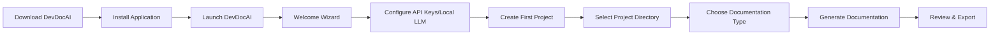
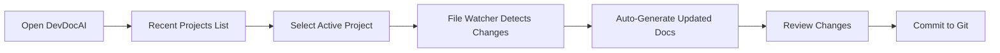
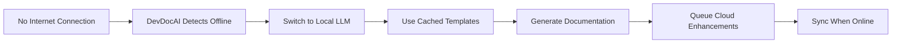

# Pass 0: Frontend Design Validation - Desktop Application Focus

## Executive Summary

DevDocAI v3.0.0 is a **local desktop application** that developers download and run on their MacBooks, not a traditional web application. This fundamental distinction requires a complete redesign of the user experience, focusing on local file system integration, offline capabilities, and desktop-first interaction patterns.

**Critical Context:**
- **Deployment Model**: Open-source desktop application downloaded via pip/npm/binary
- **Access Method**: localhost:3000 on developer's MacBook
- **User Journey**: Download → Install → Configure → Use Locally → Export/Share
- **Brand Assets**: New logo variants available for integration (black/white/transparent in S/M/L)

## 1. Requirements Analysis - Desktop Application UX

### 1.1 Core Desktop Application Requirements

#### Local-First Architecture
- **File System Integration**: Direct access to user's project directories
- **Project Management**: Local workspace/project context persistence
- **Template Storage**: Local template library with marketplace sync
- **Output Management**: Direct file writing to user's project structure

#### Offline-Complete Functionality
- **Core Features**: All documentation generation works without internet
- **AI Models**: Support for local LLM models (llama.cpp, Ollama)
- **Template Library**: Cached marketplace templates for offline use
- **Documentation**: Built-in offline documentation and help system

#### Desktop Integration Patterns
- **Drag & Drop**: Files/folders into application for analysis
- **File Associations**: .devdocai project files, template files
- **System Tray**: Quick access and background processing
- **Native Notifications**: Generation complete, errors, updates
- **Keyboard Shortcuts**: Power user productivity features

### 1.2 User Expectations for Desktop Applications

#### Performance Expectations
- **Instant Startup**: <3 seconds to interactive UI
- **Responsive UI**: No network latency for UI interactions
- **Background Processing**: Non-blocking document generation
- **Resource Awareness**: Memory/CPU usage monitoring and limits

#### Data Security & Privacy
- **Local Storage**: All data remains on user's machine
- **No Telemetry**: Zero data collection by default
- **API Key Management**: Secure local storage with OS keychain
- **Project Isolation**: Clear separation between projects

#### Professional Tool Integration
- **IDE Integration**: VS Code extension, terminal commands
- **Git Integration**: Documentation version control
- **CI/CD Integration**: Command-line interface for automation
- **Export Formats**: Markdown, HTML, PDF, DocBook

## 2. Component Architecture - Local Application Design

### 2.1 Core Application Shell

```typescript
interface DesktopAppShell {
  // Application Window Management
  window: {
    titleBar: CustomTitleBar;  // Native-like title bar
    menuBar: ApplicationMenu;   // File, Edit, View, Tools, Help
    statusBar: StatusBar;        // Processing status, resource usage
    sidePanel: NavigationPanel;  // Project explorer, templates
    mainContent: ContentArea;    // Document editor/viewer
  };

  // Local State Management
  state: {
    projects: LocalProjectStore;     // Project configurations
    templates: LocalTemplateCache;   // Cached templates
    settings: ApplicationSettings;   // User preferences
    recent: RecentDocuments;        // Quick access
  };

  // Background Services
  services: {
    fileWatcher: FileSystemWatcher;  // Monitor project changes
    generator: DocumentGenerator;    // Background processing
    analyzer: CodeAnalyzer;          // Project analysis
    llmBridge: LLMConnector;        // AI model management
  };
}
```

### 2.2 Desktop-First Components

#### Project Manager Component
```typescript
interface ProjectManager {
  // Project workspace management
  createProject(path: string): Project;
  openProject(path: string): Project;
  importProject(archive: File): Project;

  // Local file operations
  scanDirectory(path: string): FileTree;
  watchFiles(patterns: string[]): FileWatcher;

  // Project templates
  applyTemplate(template: ProjectTemplate): void;
  exportProject(format: ExportFormat): void;
}
```

#### Local Template Library
```typescript
interface TemplateLibrary {
  // Local template management
  installedTemplates: LocalTemplate[];
  customTemplates: UserTemplate[];

  // Marketplace sync (when online)
  syncMarketplace(): Promise<void>;
  downloadTemplate(id: string): Promise<void>;

  // Template operations
  createTemplate(config: TemplateConfig): UserTemplate;
  editTemplate(id: string): TemplateEditor;
  exportTemplate(id: string): TemplatePackage;
}
```

#### Document Workspace
```typescript
interface DocumentWorkspace {
  // Multi-document management
  openDocuments: Document[];
  activeDocument: Document | null;

  // Editor features
  splitView: boolean;
  diffView: DiffViewer;
  previewPane: PreviewRenderer;

  // Local generation
  generateLocally(options: GenerationOptions): void;
  enhanceWithAI(provider: AIProvider): void;
  exportDocument(format: ExportFormat): void;
}
```

### 2.3 Native Desktop Behaviors

#### File System Integration
- **Project Picker**: Native file dialog for project selection
- **Drag & Drop Zones**: Drop files/folders anywhere for import
- **Recent Projects**: Quick access from File menu
- **Auto-Save**: Continuous local saving with versioning
- **File Watching**: Auto-refresh on external changes

#### Window Management
- **Multi-Window Support**: Open multiple projects simultaneously
- **Window State Persistence**: Remember size/position
- **Tabs Management**: Document tabs with close/save indicators
- **Split Panes**: Side-by-side document comparison
- **Fullscreen Mode**: Distraction-free documentation writing

#### Keyboard Navigation
- **Command Palette**: Cmd+Shift+P for all actions
- **Quick Open**: Cmd+P for file navigation
- **Generate**: Cmd+G for quick generation
- **Search**: Cmd+F for in-document search
- **Settings**: Cmd+, for preferences

## 3. Landing Page Redesign Strategy

### 3.1 Download-Focused Landing Page

The landing page must communicate that DevDocAI is a **downloadable desktop tool**, not a web service.

#### Hero Section Redesign
```html
<section class="hero">
  <div class="hero-content">
    
    <h1>AI-Powered Documentation for Your Local Development</h1>
    <p>Generate professional documentation directly on your MacBook.
       No cloud, no subscriptions, just powerful local AI.</p>

    <div class="download-section">
      <button class="primary-cta">
        <AppleIcon /> Download for macOS
        <span class="version">v3.0.0 • 47MB</span>
      </button>

      <div class="alternative-installs">
        <code>pip install devdocai</code>
        <code>brew install devdocai</code>
      </div>
    </div>

    <div class="system-requirements">
      <span>Requires macOS 11+ • 8GB RAM • Python 3.8+</span>
    </div>
  </div>

  <div class="hero-screenshot">
    
    <caption>DevDocAI Studio running locally on localhost:3000</caption>
  </div>
</section>
```

#### Value Propositions for Desktop
```typescript
const desktopValueProps = [
  {
    icon: "🔒",
    title: "100% Private & Local",
    description: "Your code never leaves your machine. No telemetry, no tracking."
  },
  {
    icon: "⚡",
    title: "Offline-First Design",
    description: "Works completely offline with local LLMs or cached AI responses."
  },
  {
    icon: "🛠️",
    title: "Developer Tool Integration",
    description: "Seamless integration with VS Code, Git, and your existing workflow."
  },
  {
    icon: "🚀",
    title: "Lightning Fast",
    description: "No network latency. Process 412K docs/minute locally."
  }
];
```

#### Installation Instructions Section
```html
<section class="installation">
  <h2>Get Started in 3 Steps</h2>

  <div class="install-steps">
    <div class="step">
      <span class="step-number">1</span>
      <h3>Download & Install</h3>
      <code>brew install devdocai</code>
      <p>Or download the .dmg installer</p>
    </div>

    <div class="step">
      <span class="step-number">2</span>
      <h3>Configure API Keys</h3>
      <code>devdocai configure</code>
      <p>Optional: Use local LLMs for complete offline</p>
    </div>

    <div class="step">
      <span class="step-number">3</span>
      <h3>Start Documenting</h3>
      <code>devdocai serve</code>
      <p>Opens at localhost:3000</p>
    </div>
  </div>
</section>
```

### 3.2 Desktop App Screenshots

Replace generic web app imagery with actual desktop application screenshots:

```typescript
const screenshotGallery = [
  {
    title: "Project Management",
    image: "/screenshots/project-explorer.png",
    description: "Manage multiple documentation projects locally"
  },
  {
    title: "Document Studio",
    image: "/screenshots/document-studio.png",
    description: "Professional documentation workspace"
  },
  {
    title: "Template Library",
    image: "/screenshots/template-library.png",
    description: "Local and marketplace templates"
  },
  {
    title: "AI Enhancement",
    image: "/screenshots/ai-enhancement.png",
    description: "Local or cloud AI processing"
  }
];
```

## 4. Desktop UX Patterns & User Journeys

### 4.1 First-Time User Journey



### 4.2 Daily Workflow Journey



### 4.3 Offline Documentation Journey



## 5. Technical Architecture - Local Application

### 5.1 Technology Stack Validation

#### Current Stack Assessment
- **Frontend**: Next.js 15.5.3 (Good for desktop via Electron/Tauri)
- **Backend**: FastAPI (Python) - Excellent for local server
- **Database**: SQLite with SQLCipher - Perfect for local storage
- **AI Integration**: Multiple LLM providers + local model support

#### Recommended Desktop Wrapper Options

**Option 1: Electron Integration** (Heavier but mature)
```javascript
// electron-main.js
const { app, BrowserWindow } = require('electron');

function createWindow() {
  const win = new BrowserWindow({
    width: 1400,
    height: 900,
    webPreferences: {
      nodeIntegration: true,
      contextIsolation: false
    },
    titleBarStyle: 'hiddenInset',
    trafficLightPosition: { x: 10, y: 10 }
  });

  // Load Next.js app
  win.loadURL('http://localhost:3000');

  // Start Python backend
  spawn('python', ['main.py'], { cwd: __dirname });
}
```

**Option 2: Tauri Integration** (Lighter, Rust-based)
```rust
// src-tauri/src/main.rs
#![cfg_attr(
  all(not(debug_assertions), target_os = "windows"),
  windows_subsystem = "windows"
)]

fn main() {
  tauri::Builder::default()
    .invoke_handler(tauri::generate_handler![
      open_project,
      generate_document,
      manage_templates
    ])
    .run(tauri::generate_context!())
    .expect("error while running tauri application");
}
```

**Option 3: Progressive Web App** (Current approach, enhanced)
- Keep current Next.js + localhost approach
- Add PWA manifest for "installable" web app
- Use File System Access API for local file operations
- Service Worker for offline functionality

### 5.2 Local Storage Architecture

```typescript
interface LocalStorageArchitecture {
  // Application Data Directory
  // ~/Library/Application Support/DevDocAI/
  appData: {
    settings: 'settings.json',
    projects: 'projects.db',
    templates: 'templates/',
    cache: 'cache/',
    logs: 'logs/'
  };

  // User Documents
  // ~/Documents/DevDocAI/
  userDocs: {
    projects: 'Projects/',
    exports: 'Exports/',
    customTemplates: 'Templates/'
  };

  // Secure Storage
  // OS Keychain
  secure: {
    apiKeys: KeychainStorage,
    tokens: SecureTokenStore
  };
}
```

### 5.3 Performance Optimization for Desktop

```typescript
interface PerformanceOptimizations {
  // Resource Management
  resourceLimits: {
    maxMemory: '2GB',
    maxCPU: '80%',
    maxFileWatchers: 100,
    maxOpenDocuments: 20
  };

  // Background Processing
  backgroundTasks: {
    documentGeneration: WorkerThread,
    projectAnalysis: BackgroundWorker,
    templateSync: IdleScheduler,
    cacheCleanup: CronJob
  };

  // UI Responsiveness
  uiOptimizations: {
    virtualScrolling: true,
    lazyLoading: true,
    debouncing: true,
    progressiveRendering: true
  };
}
```

## 6. Brand Integration Requirements

### 6.1 Logo Asset Utilization

```typescript
const logoAssets = {
  // Application Icons
  appIcon: '/docs/assets/devdocai_black_large.png',  // 512x512 for .icns
  trayIcon: '/docs/assets/devdocai_black_small.png', // 22x22 for menu bar

  // In-App Branding
  headerLogo: '/docs/assets/devdocai_transparent_medium.png',
  splashScreen: '/docs/assets/devdocai_white_large.png',
  aboutDialog: '/docs/assets/devdocai_transparent_large.png',

  // Marketing Materials
  websiteLogo: '/docs/assets/devdocai_black_medium.png',
  socialMedia: '/docs/assets/devdocai_white_medium.png',
  documentation: '/docs/assets/devdocai_transparent_small.png'
};
```

### 6.2 Design System Integration

```scss
// Design tokens aligned with brand
:root {
  // Brand Colors (extracted from logo)
  --brand-primary: #2563EB;    // Blue from gradient
  --brand-secondary: #9333EA;  // Purple from gradient
  --brand-dark: #111827;       // Near black
  --brand-light: #F9FAFB;      // Near white

  // Desktop Application Colors
  --window-bg: #FFFFFF;
  --sidebar-bg: #F3F4F6;
  --toolbar-bg: #F9FAFB;
  --status-bar-bg: #1F2937;

  // Interactive Elements
  --button-primary: linear-gradient(135deg, var(--brand-primary), var(--brand-secondary));
  --button-hover: linear-gradient(135deg, #1D4ED8, #7C3AED);
  --focus-ring: 0 0 0 3px rgba(37, 99, 235, 0.2);
}
```

## 7. Implementation Roadmap

### Phase 1: Foundation (Week 1-2)
- [ ] Finalize desktop wrapper technology (Electron/Tauri/PWA)
- [ ] Implement local file system integration
- [ ] Create project management system
- [ ] Set up local storage architecture

### Phase 2: Core Desktop Features (Week 3-4)
- [ ] Build native-like application shell
- [ ] Implement file watching and auto-refresh
- [ ] Create offline mode detection and switching
- [ ] Add drag-and-drop functionality

### Phase 3: Landing Page Redesign (Week 5)
- [ ] Create download-focused hero section
- [ ] Add installation instructions
- [ ] Include desktop app screenshots
- [ ] Implement system requirements checker

### Phase 4: Desktop UX Polish (Week 6)
- [ ] Add keyboard shortcuts
- [ ] Implement native notifications
- [ ] Create context menus
- [ ] Add window state persistence

### Phase 5: Integration & Testing (Week 7-8)
- [ ] Test on various macOS versions
- [ ] Optimize performance for different hardware
- [ ] Create installation packages (.dmg, brew formula)
- [ ] Write desktop-specific documentation

## 8. Success Metrics

### Desktop Application Metrics
- **Installation Success Rate**: >95% successful installs
- **First-Run Experience**: <30 seconds to first document
- **Offline Functionality**: 100% core features work offline
- **Performance**: <3 second startup, <100ms UI response
- **Resource Usage**: <500MB RAM idle, <2GB during generation

### User Satisfaction Metrics
- **Setup Simplicity**: <5 minutes from download to first use
- **Workflow Integration**: 80% users integrate with existing tools
- **Offline Usage**: 40% of generations happen offline
- **Local LLM Adoption**: 25% users try local models
- **Daily Active Usage**: 60% weekly retention

## 9. Risk Mitigation

### Technical Risks
- **Risk**: Electron bundle size too large
  - **Mitigation**: Consider Tauri or enhanced PWA approach

- **Risk**: Local LLM performance insufficient
  - **Mitigation**: Hybrid approach with cloud fallback

- **Risk**: File system permissions issues
  - **Mitigation**: Clear permission requests and fallbacks

### User Experience Risks
- **Risk**: Users expect cloud features
  - **Mitigation**: Clear messaging about local-first benefits

- **Risk**: Installation complexity
  - **Mitigation**: Multiple installation methods, great documentation

## 10. Conclusion

DevDocAI v3.0.0's desktop application nature is its greatest strength, offering developers complete control, privacy, and integration with their local development environment. The frontend design must embrace this desktop-first approach, creating an experience that feels native, powerful, and trustworthy.

Key decisions needed:
1. Desktop wrapper technology selection
2. Depth of native OS integration
3. Balance between web UI and native controls
4. Local LLM integration priority
5. Offline-first vs. hybrid approach

The success of DevDocAI as a desktop application depends on delivering a superior local experience that cloud-based solutions cannot match: instant responsiveness, complete privacy, deep system integration, and zero latency operations.
