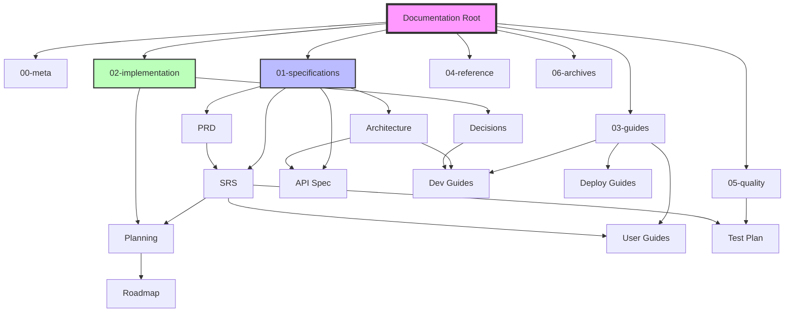

# DevDocAI Documentation Map

This map shows the relationships and dependencies between all documentation in the DevDocAI project.

## Document Hierarchy and Relationships



## Document Flow

### 1. Requirements Flow

```
User Stories → PRD → SRS → Architecture → Implementation
     ↓          ↓      ↓         ↓            ↓
  Mockups    Roadmap  Tests   API Docs    Code/Tests
```

### 2. Implementation Flow

```
Design Specs → Planning → Development → Testing → Deployment
      ↓           ↓           ↓           ↓          ↓
   Immutable   SCMP/Road   Progress    Test Plan   Guides
```

### 3. Knowledge Flow

```
Specifications → Guides → Reference → Usage
       ↓           ↓         ↓         ↓
   Technical    How-to    Quick Ref  Practice
```

## Document Categories by Audience

### Product Stakeholders

- **Primary**: PRD, Roadmap, User Stories
- **Secondary**: Mockups, User Manual
- **Reference**: Progress tracking

### Developers

- **Primary**: Architecture, SDD, API Documentation
- **Secondary**: Contributing Guide, Git Workflow
- **Reference**: Design Decisions, Test Plan

### End Users

- **Primary**: User Manual, User Documentation
- **Secondary**: Installation Guide
- **Reference**: API documentation (if using API)

### System Administrators

- **Primary**: Deployment Guide, Maintenance Plan
- **Secondary**: Build Instructions
- **Reference**: Configuration reference

### Quality Assurance

- **Primary**: Test Plan, Traceability Matrix
- **Secondary**: SRS, User Stories
- **Reference**: Quality metrics

## Document Dependencies

### Critical Dependencies

These documents must be read in order:

1. **Business Context**

   ```
   PRD → User Stories → Mockups
   ```

2. **Technical Context**

   ```
   Architecture → SDD → API Documentation
   ```

3. **Implementation Path**

   ```
   SRS → Architecture → Module Specs → Implementation
   ```

### Cross-References

| From Document | References | Purpose |
|--------------|------------|---------|
| SRS | PRD, User Stories | Requirements source |
| Architecture | SRS, PRD | Requirements implementation |
| API Docs | Architecture, SRS | Interface specification |
| Test Plan | SRS, User Stories | Test coverage |
| User Manual | PRD, Mockups | Feature documentation |
| Deployment Guide | Architecture, Build Instructions | System setup |

## Reading Paths

### Quick Start Path

1. README.md (root)
2. Installation Guide
3. User Manual (basics)

### Developer Onboarding Path

1. README.md (root)
2. Contributing Guide
3. Architecture Overview
4. Git Workflow
5. Development setup in Build Instructions

### Full Understanding Path

1. PRD (vision)
2. User Stories (requirements)
3. Architecture (design)
4. SRS (detailed requirements)
5. API Documentation
6. Implementation guides

### Implementation Path

1. Check module dependencies
2. Read module specification
3. Review test requirements
4. Follow build instructions
5. Update progress tracking

## Document Lifecycle

### Active Documents (Maintained)

- All files in 01-specifications (frozen but referenced)
- All files in 02-implementation (actively updated)
- All files in 03-guides (updated with features)
- All files in 04-reference (updated as needed)
- All files in 05-quality (continuously updated)

### Static Documents (Frozen)

- Design specifications (01-specifications/*)
- Completed sprint documentation
- Archived versions

### Living Documents (Continuous Updates)

- Progress tracking
- Roadmap
- Contributing guide
- Quality metrics
- Reference materials

## Navigation Guide

### Finding Information

| If you need to... | Go to... |
|-------------------|----------|
| Understand what DevDocAI does | PRD, User Stories |
| See how it's built | Architecture, SDD |
| Implement a feature | Module specs, API docs |
| Contribute code | Contributing, Git Workflow |
| Deploy the system | Deployment Guide |
| Use the system | User Manual |
| Test features | Test Plan |
| Track progress | Implementation/progress |
| Find templates | 00-meta/templates |
| See API reference | 04-reference/api |

### Document Relationships Matrix

```
                 PRD  Arch  SRS  API  Test  User  Dev
PRD               -    →     →    -    -     →     -
Architecture      ←    -     ←    →    →     -     →
SRS               ←    →     -    →    →     →     -
API Docs          -    ←     ←    -    -     -     →
Test Plan         ←    ←     ←    ←    -     -     -
User Guides       ←    -     ←    -    -     -     -
Dev Guides        -    ←     -    ←    ←     -     -

← = references/depends on
→ = referenced by/influences
- = no direct relationship
```

## Quality Assurance

### Documentation Completeness

- ✅ Specifications: 100% complete
- ⏳ Implementation: 0% (starting)
- ✅ User Guides: Complete for current design
- ✅ Developer Guides: Ready for contributors
- ✅ Deployment Guides: Complete
- ⏳ Reference: Building as implementation progresses

### Documentation Coverage

- Every module has specifications
- Every API endpoint is documented
- Every user feature has guides
- Every quality requirement has tests
- Every decision has rationale

## Maintenance Schedule

| Document Type | Update Frequency | Trigger |
|--------------|------------------|---------|
| Progress Tracking | Daily | Development activity |
| Roadmap | Sprint | Planning changes |
| API Reference | Feature | API changes |
| User Guides | Release | New features |
| Test Results | Continuous | Test runs |
| Archives | As needed | Deprecation |
