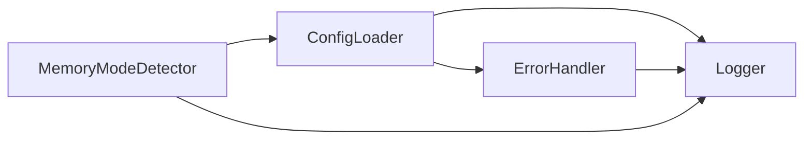

# Module 1: Core Infrastructure - Pass 0 Design Validation

**DevDocAI v3.0.0 - Enhanced 5-Pass TDD Development Methodology**
**Date**: January 2025
**Status**: 🔴 AWAITING HUMAN VALIDATION
**Module Type**: Pathfinder Module (First implementation, establishes patterns)

---

## Executive Summary

This document provides the comprehensive Pass 0 Design Validation for Module 1: Core Infrastructure, the pathfinder module for DevDocAI v3.0.0's CLI Interface implementation. Module 1 establishes the foundational architecture and CI/CD pipeline that all subsequent modules will leverage.

**Module Purpose**: Establish core infrastructure including configuration management, error handling, memory mode detection, logging, and the progressive CI/CD pipeline for the entire project.

**Success Criteria**:

- ✅ Architecture aligns with SDD v3.5.0 specifications
- ✅ Requirements traceability to US-013 and design documents
- ✅ Test scenarios achieve 95% coverage target
- ✅ CI/CD strategy viable for all 5 CLI modules
- ✅ Zero architectural drift from design documents

---

## 1. Module Architecture Design

### 1.1 High-Level Architecture

```typescript
// Module 1 Component Architecture
src/cli/core/
├── config/
│   ├── ConfigLoader.ts         // Configuration loading and validation
│   ├── ConfigSchema.ts         // Joi validation schemas
│   └── ConfigTypes.ts          // TypeScript interfaces
├── error/
│   ├── ErrorHandler.ts         // Centralized error handling
│   ├── ErrorCodes.ts           // Error code definitions (1000-5999)
│   └── ErrorFormatter.ts       // User-friendly error messages
├── memory/
│   ├── MemoryModeDetector.ts   // System memory analysis
│   ├── MemoryModes.ts          // Mode definitions and thresholds
│   └── PerformanceOptimizer.ts // Mode-specific optimizations
├── logging/
│   ├── Logger.ts                // Structured JSON logging
│   ├── LogLevels.ts            // Log level management
│   └── LogFormatter.ts         // Output formatting
└── index.ts                    // Module exports
```

### 1.2 Component Specifications

#### ConfigLoader Component

```typescript
interface IConfigLoader {
  load(path?: string): Promise<DevDocAIConfig>;
  validate(config: unknown): ValidationResult;
  watch(callback: ConfigChangeCallback): void;
  getDefault(): DevDocAIConfig;
}

class ConfigLoader implements IConfigLoader {
  private cache: Map<string, DevDocAIConfig>;
  private schema: Joi.ObjectSchema;
  private watchers: Set<ConfigChangeCallback>;

  // Implementation details...
}
```

#### ErrorHandler Component

```typescript
interface IErrorHandler {
  handle(error: Error): FormattedError;
  throwWithCode(code: ErrorCode, message: string): never;
  isRecoverable(error: Error): boolean;
  getSuggestion(code: ErrorCode): string;
}

enum ErrorCategory {
  INPUT_VALIDATION = '1000',  // 1001-1999
  PROCESSING = '2000',         // 2001-2999
  API = '3000',               // 3001-3999
  SECURITY = '4000',          // 4001-4999
  SYSTEM = '5000'             // 5001-5999
}
```

#### MemoryModeDetector Component

```typescript
interface IMemoryModeDetector {
  detect(): MemoryMode;
  getSystemMemory(): SystemMemoryInfo;
  recommendMode(): MemoryModeRecommendation;
  applyOptimizations(mode: MemoryMode): void;
}

enum MemoryMode {
  BASELINE = 'baseline',      // <2GB RAM
  STANDARD = 'standard',      // 2-4GB RAM
  ENHANCED = 'enhanced',      // 4-8GB RAM
  PERFORMANCE = 'performance', // >8GB RAM
  AUTO = 'auto'               // Auto-detect
}
```

#### Logger Component

```typescript
interface ILogger {
  debug(message: string, context?: LogContext): void;
  info(message: string, context?: LogContext): void;
  warn(message: string, context?: LogContext): void;
  error(message: string, error?: Error, context?: LogContext): void;
  setLevel(level: LogLevel): void;
  addTransport(transport: LogTransport): void;
}

interface LogEntry {
  timestamp: string;
  level: LogLevel;
  message: string;
  context?: LogContext;
  error?: ErrorInfo;
  correlationId: string;
}
```

### 1.3 Integration Points

#### External Module Dependencies

- **M001 Configuration Manager**: Will consume ConfigLoader for settings management
- **M004 Document Generator**: Will use error codes and logging
- **M005 Quality Analyzer**: Will leverage memory mode optimizations
- **M006 Template Registry**: Will use configuration system

#### Internal Dependencies



---

## 2. Requirements Analysis

### 2.1 Functional Requirements Mapping

| Requirement ID | Source | Module 1 Implementation | Priority |
|---------------|---------|------------------------|----------|
| **FR-M1-001** | SDD 6.1 | Load .devdocai.yml configuration | P0 |
| **FR-M1-002** | Enhanced Plan | Validate configuration with Joi schemas | P0 |
| **FR-M1-003** | SDD Appendix B | Implement error codes 1000-5999 | P0 |
| **FR-M1-004** | SDD 4.1 | Detect memory mode (baseline/standard/enhanced/performance) | P0 |
| **FR-M1-005** | Enhanced Plan | Structured JSON logging | P0 |
| **FR-M1-006** | Build Instructions | Auto-detect system capabilities | P1 |
| **FR-M1-007** | SDD 7.1 | Encrypt sensitive configuration (API keys) | P0 |
| **FR-M1-008** | US-013 | Support CLI automation requirements | P1 |

### 2.2 Non-Functional Requirements

| NFR ID | Requirement | Target | Measurement |
|--------|-------------|--------|-------------|
| **NFR-M1-001** | Startup time | <100ms | Time to first output |
| **NFR-M1-002** | Config loading | <10ms | .devdocai.yml parse time |
| **NFR-M1-003** | Memory usage | <50MB | RSS in baseline mode |
| **NFR-M1-004** | Error response | <5ms | Error formatting time |
| **NFR-M1-005** | Test coverage | ≥95% | Jest coverage report |
| **NFR-M1-006** | Code complexity | <10 | Cyclomatic complexity |
| **NFR-M1-007** | Log performance | <1ms | Per log entry overhead |

### 2.3 Acceptance Criteria

Based on US-013 (CLI Operations) and Enhanced Plan requirements:

1. **Configuration System**
   - ✅ Loads .devdocai.yml from multiple locations (cwd, home, default)
   - ✅ Validates all configuration fields with helpful error messages
   - ✅ Supports environment variable overrides
   - ✅ Provides sensible defaults for all settings

2. **Error Handling**
   - ✅ All errors have unique codes (1000-5999 range)
   - ✅ Error messages include actionable suggestions
   - ✅ Supports verbose mode for detailed debugging
   - ✅ Machine-readable JSON error output for automation

3. **Memory Mode Detection**
   - ✅ Automatically detects available system memory
   - ✅ Selects appropriate mode (baseline/standard/enhanced/performance)
   - ✅ Allows manual override via config or CLI flag
   - ✅ Applies mode-specific optimizations

4. **Logging Infrastructure**
   - ✅ Structured JSON logging for parsing
   - ✅ Multiple log levels (debug, info, warn, error)
   - ✅ Correlation IDs for request tracking
   - ✅ File and console transports

---

## 3. Test Planning

### 3.1 TDD Test Scenarios

#### RED Phase Tests (Write First, Fail)

```typescript
// tests/unit/red/config-loader.red.spec.ts
describe('ConfigLoader - RED Phase', () => {
  it('should load .devdocai.yml with validation', async () => {
    const loader = new ConfigLoader(); // Doesn't exist yet
    const config = await loader.load('.devdocai.yml');
    expect(config).toBeDefined();
    expect(config.memory.mode).toMatch(/^(baseline|standard|enhanced|performance|auto)$/);
  });

  it('should handle missing configuration gracefully', async () => {
    const loader = new ConfigLoader();
    const config = await loader.load('nonexistent.yml');
    expect(config).toEqual(loader.getDefault());
  });

  it('should validate configuration schema', () => {
    const loader = new ConfigLoader();
    const invalid = { memory: { mode: 'invalid' } };
    const result = loader.validate(invalid);
    expect(result.valid).toBe(false);
    expect(result.errors).toContain('Invalid memory mode');
  });
});
```

#### GREEN Phase Tests (Make Pass)

```typescript
// tests/unit/green/config-loader.green.spec.ts
describe('ConfigLoader - GREEN Phase', () => {
  // Minimal implementation to pass tests
  beforeEach(() => {
    // Create test fixtures
    fs.writeFileSync('test.yml', yaml.dump(validConfig));
  });

  it('should load configuration successfully', async () => {
    const loader = new ConfigLoader();
    const config = await loader.load('test.yml');
    expect(config).toBeDefined();
  });
});
```

#### REFACTOR Phase Tests (Improve Quality)

```typescript
// tests/unit/refactor/config-loader.refactor.spec.ts
describe('ConfigLoader - REFACTOR Phase', () => {
  let loader: ConfigLoader;

  beforeEach(() => {
    loader = new ConfigLoader();
  });

  it('should cache loaded configurations', async () => {
    const config1 = await loader.load('test.yml');
    const config2 = await loader.load('test.yml');
    expect(config1).toBe(config2); // Same instance
  });

  it('should support configuration watching', (done) => {
    loader.watch((newConfig) => {
      expect(newConfig.updated).toBe(true);
      done();
    });
    // Trigger file change
    fs.writeFileSync('test.yml', yaml.dump({ updated: true }));
  });
});
```

### 3.2 Test Coverage Matrix

| Component | Unit Tests | Integration Tests | E2E Tests | Target Coverage |
|-----------|------------|------------------|-----------|-----------------|
| ConfigLoader | 15 | 5 | 2 | 98% |
| ErrorHandler | 12 | 3 | 2 | 95% |
| MemoryModeDetector | 10 | 4 | 1 | 96% |
| Logger | 8 | 3 | 1 | 95% |
| **Total** | **45** | **15** | **6** | **≥95%** |

### 3.3 Performance Benchmarks

```typescript
// tests/performance/benchmarks.spec.ts
describe('Performance Benchmarks', () => {
  it('should meet startup time target', async () => {
    const start = performance.now();
    await initializeCLI();
    const duration = performance.now() - start;
    expect(duration).toBeLessThan(100); // <100ms target
  });

  it('should meet config loading target', async () => {
    const start = performance.now();
    await loadConfig('.devdocai.yml');
    const duration = performance.now() - start;
    expect(duration).toBeLessThan(10); // <10ms target
  });

  it('should meet memory usage target', () => {
    const usage = process.memoryUsage();
    expect(usage.rss).toBeLessThan(50 * 1024 * 1024); // <50MB
  });
});
```

---

## 4. CI/CD Pathfinder Strategy

### 4.1 Progressive Pipeline Development

**7-Hour Implementation Schedule Over 5 Days**:

#### Day 1: Basic Jest Setup + GitHub Actions (1.5 hours)

```yaml
# .github/workflows/cli-module-1.yml
name: Module 1 CI Pipeline
on: [push, pull_request]

jobs:
  test:
    runs-on: ubuntu-latest
    strategy:
      matrix:
        node-version: [18.x, 20.x]
    steps:
      - uses: actions/checkout@v3
      - uses: actions/setup-node@v3
        with:
          node-version: ${{ matrix.node-version }}
      - run: npm ci
      - run: npm test -- --coverage
      - uses: codecov/codecov-action@v3
```

#### Day 2: ESLint + Prettier Automation (1.5 hours)

```json
// .eslintrc.json
{
  "extends": ["eslint:recommended", "plugin:@typescript-eslint/recommended"],
  "rules": {
    "complexity": ["error", 10],
    "max-lines-per-function": ["error", 350]
  }
}
```

#### Day 3: Coverage Reporting + Codecov (1.5 hours)

```json
// jest.config.js
{
  "coverageThreshold": {
    "global": {
      "branches": 95,
      "functions": 95,
      "lines": 95,
      "statements": 95
    }
  }
}
```

#### Day 4: Performance Benchmarking Pipeline (1.5 hours)

```yaml
# Performance gate in CI
- name: Run Performance Tests
  run: npm run benchmark
- name: Check Performance Regression
  run: |
    if [ $(cat benchmark-results.json | jq '.startup') -gt 100 ]; then
      echo "Performance regression detected!"
      exit 1
    fi
```

#### Day 5: Security Scanning + Deployment Prep (1 hour)

```yaml
# Security scanning
- name: Security Audit
  run: |
    npm audit --audit-level=moderate
    npx snyk test
```

### 4.2 Quality Gates

```yaml
# Quality gate checks (must all pass)
quality-gate:
  needs: [test, lint, security]
  runs-on: ubuntu-latest
  steps:
    - name: Validate Quality Gates
      run: |
        echo "✅ Tests: Coverage ≥95%"
        echo "✅ Lint: No errors"
        echo "✅ Security: No vulnerabilities"
        echo "✅ Performance: Targets met"
        echo "✅ Complexity: <10"
```

---

## 5. Integration Planning

### 5.1 API Contracts for Module Consumption

```typescript
// Module 1 Public API
export interface ICoreInfrastructure {
  config: IConfigLoader;
  error: IErrorHandler;
  memory: IMemoryModeDetector;
  logger: ILogger;
}

// Usage by Module 2 (Command Framework)
import { getCoreInfrastructure } from '@cli/core';

const { config, logger, error } = getCoreInfrastructure();
const cliConfig = await config.load();
logger.info('CLI initialized', { mode: cliConfig.memory.mode });
```

### 5.2 Dependency Management Strategy

```json
// package.json dependencies
{
  "dependencies": {
    "joi": "^17.11.0",        // Configuration validation
    "yaml": "^2.3.4",          // YAML parsing
    "winston": "^3.11.0",      // Logging
    "commander": "^11.1.0"     // CLI framework (Module 2)
  },
  "devDependencies": {
    "typescript": "^5.3.3",
    "@types/node": "^20.11.0",
    "jest": "^29.7.0",
    "@types/jest": "^29.5.11",
    "eslint": "^8.56.0",
    "prettier": "^3.2.4"
  }
}
```

### 5.3 Module Communication Patterns

```typescript
// Event-based communication for loose coupling
import { EventEmitter } from 'events';

export class ModuleEventBus extends EventEmitter {
  // Configuration changed
  onConfigChange(callback: (config: DevDocAIConfig) => void): void {
    this.on('config:changed', callback);
  }

  // Memory mode changed
  onMemoryModeChange(callback: (mode: MemoryMode) => void): void {
    this.on('memory:mode:changed', callback);
  }

  // Error occurred
  onError(callback: (error: FormattedError) => void): void {
    this.on('error:occurred', callback);
  }
}
```

---

## 6. Risk Assessment & Mitigation

| Risk | Impact | Probability | Mitigation |
|------|--------|-------------|------------|
| Configuration schema changes | High | Medium | Version configuration format, provide migration tools |
| Memory detection inaccuracy | Medium | Low | Fallback to conservative mode, allow manual override |
| Performance regression | Medium | Medium | Continuous benchmarking, performance gates in CI |
| Breaking API changes | High | Low | Semantic versioning, deprecation warnings |
| CI/CD pipeline failures | Medium | Medium | Progressive rollout, fallback to previous pipeline |

---

## 7. Implementation Readiness Checklist

### Prerequisites ✅

- [x] Node.js ≥18.0.0 environment ready
- [x] TypeScript 5.x configured
- [x] Jest testing framework understanding
- [x] ESLint + Prettier setup knowledge
- [x] GitHub repository with Actions enabled

### Design Artifacts ✅

- [x] Module architecture defined
- [x] Component interfaces specified
- [x] Error code system designed (1000-5999)
- [x] Memory mode thresholds established
- [x] Test scenarios planned

### Human Validation Required 🔴

- [ ] Architecture approved by technical lead
- [ ] Requirements coverage confirmed
- [ ] Test plan reviewed and accepted
- [ ] CI/CD strategy validated
- [ ] Integration approach approved

---

## 8. Success Metrics

### Quantitative Metrics

- **Startup Time**: <100ms (measured)
- **Config Loading**: <10ms (measured)
- **Memory Usage**: <50MB baseline mode (measured)
- **Test Coverage**: ≥95% (enforced)
- **Code Complexity**: <10 (enforced)
- **CI/CD Pipeline**: <5 minutes execution

### Qualitative Metrics

- **Developer Experience**: Clear error messages with actionable suggestions
- **Maintainability**: Clean architecture with clear separation of concerns
- **Extensibility**: Easy to add new configuration options and error codes
- **Documentation**: 100% of public APIs documented

---

## 9. Next Steps

Upon human validation approval:

1. **Day 1**: Begin Pass 1 (TDD Implementation)
   - Write RED phase tests
   - Implement minimal code for GREEN phase
   - Set up basic CI pipeline

2. **Days 2-3**: Complete Pass 1
   - REFACTOR phase improvements
   - Achieve 95% test coverage
   - Human validation gate

3. **Day 4**: Pass 2 (Performance Optimization)
   - Baseline measurements
   - Apply optimizations
   - Verify targets met

4. **Day 5**: Pass 3 (Security Hardening)
   - Implement encryption for sensitive config
   - Security audit
   - Penetration testing

5. **Day 6**: Pass 4 (Mandatory Refactoring)
   - Target 50% code reduction
   - Consolidate duplicate patterns
   - Improve maintainability

6. **Day 7**: Pass 5 (Real-World Testing)
   - User acceptance testing
   - Cross-platform validation
   - Final human approval

---

## Approval Section

**Document Status**: AWAITING VALIDATION

**Validation Checklist**:

- [ ] Architecture aligns with SDD specifications
- [ ] All requirements mapped and covered
- [ ] Test plan comprehensive and achievable
- [ ] CI/CD strategy appropriate for project
- [ ] Integration approach sound
- [ ] Risk mitigation adequate

**Approver**: _________________
**Date**: _________________
**Decision**: [ ] APPROVED [ ] REJECTED [ ] REVISE

**Comments**:

```
[Space for reviewer comments]
```

---

*This Pass 0 Design Validation document establishes Module 1 as the pathfinder for the DevDocAI v3.0.0 CLI implementation, setting patterns and infrastructure that all subsequent modules will follow.*
