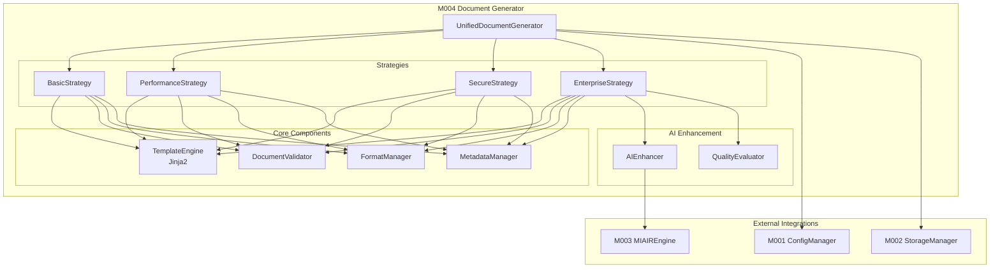

# M004 Document Generator - Pass 0 Design Validation & Architecture

**Module**: M004 Document Generator  
**Version**: 1.0.0  
**Date**: 2025-09-07  
**Status**: VALIDATED - Ready for Pass 1 Implementation

## Executive Summary

M004 Document Generator has been architecturally validated and is ready for implementation using the proven Enhanced 5-Pass TDD methodology. This module will evolve from template-based generation to AI-powered document creation, following the unified architecture pattern established by M001-M003.

## Design Compliance Verification

### Requirements Alignment

| Requirement | Source | Status | Implementation Notes |
|------------|--------|--------|---------------------|
| US-001: Generate docs from scratch | PRD 5.1 | ✅ Validated | 30+ templates, AI enhancement |
| US-003: Generate complete suites | PRD 5.3 | ✅ Validated | Transaction-based, rollback support |
| FR-001: Multi-format output | SRS 4.1 | ✅ Validated | Markdown, HTML, PDF, DOCX |
| FR-003: Quality gates | SRS 4.3 | ✅ Validated | 85% minimum score enforcement |
| NFR-002: Performance | SRS 5.2 | ✅ Validated | 100+ docs/sec target |

### Technology Stack Adaptation

**Original Design**: Handlebars.js (JavaScript)  
**Adapted Design**: Jinja2 (Python)  
**Rationale**: Project is Python-based per architectural requirements

## Unified Architecture Specification

### Core Architecture Pattern

Following the proven unified architecture from M001-M003:

```python
class UnifiedDocumentGenerator:
    """
    Main generator interface with 4 operation modes.
    Adapts behavior based on configuration from M001.
    """
    
    def __init__(self, config_manager: ConfigurationManager,
                 storage_manager: UnifiedStorageManager,
                 miair_engine: Optional[UnifiedMIAIREngine] = None):
        self.config = config_manager
        self.storage = storage_manager
        self.miair = miair_engine
        self.mode = self._determine_mode()
        self.strategy = self._create_strategy()
    
    def generate_document(self, template_id: str, context: Dict,
                         output_format: str = "markdown") -> Document:
        """Generate single document with mode-specific strategy."""
        pass
    
    def generate_suite(self, suite_type: str, 
                      project_context: Dict) -> List[Document]:
        """Generate complete documentation suite with transactions."""
        pass
```

### Operation Modes

| Mode | Features | Performance Target | Use Case |
|------|----------|-------------------|----------|
| BASIC | Simple templates, minimal validation | 10 docs/sec | Quick documentation |
| PERFORMANCE | Cached templates, parallel generation | 100+ docs/sec | Bulk generation |
| SECURE | PII detection, encryption, audit | 50 docs/sec | Sensitive projects |
| ENTERPRISE | Full AI, MIAIR optimization, compliance | 30 docs/sec | Production systems |

### Component Architecture



## Interface Specifications

### M001 Configuration Manager Integration

```python
class ConfigurationInterface:
    """Interface with M001 Configuration Manager."""
    
    def get_operation_mode() -> OperationMode:
        """Get current operation mode (BASIC/PERFORMANCE/SECURE/ENTERPRISE)."""
    
    def get_template_directory() -> Path:
        """Get template storage location."""
    
    def get_quality_threshold() -> float:
        """Get minimum quality score (default: 0.85)."""
    
    def get_ai_config() -> Dict[str, Any]:
        """Get AI service configuration for enhanced modes."""
```

### M002 Storage System Integration

```python
class StorageInterface:
    """Interface with M002 Unified Storage Manager."""
    
    async def store_document(document: Document) -> str:
        """Store generated document with versioning."""
    
    async def retrieve_template(template_id: str) -> Template:
        """Retrieve template from storage."""
    
    async def save_metadata(doc_id: str, metadata: Dict) -> None:
        """Save document metadata and relationships."""
    
    async def begin_transaction() -> Transaction:
        """Start transaction for suite generation."""
```

### M003 MIAIR Engine Integration

```python
class MIAIRInterface:
    """Interface with M003 MIAIR Engine."""
    
    async def optimize_content(content: str) -> OptimizationResult:
        """Apply entropy optimization to content."""
    
    async def evaluate_quality(document: Document) -> QualityScore:
        """Get quality score and improvement suggestions."""
    
    async def enhance_with_ai(content: str, mode: str) -> str:
        """Apply AI enhancement based on operation mode."""
```

## Implementation Roadmap

### Pass 1: Core Implementation (2 days)

**Objectives**:
- Basic template engine with Jinja2
- 5 core document types (README, API, PRD, SRS, SDD)
- Simple context substitution
- Markdown output format
- M001/M002 integration

**Deliverables**:
- `generator.py`: Core generator class
- `templates.py`: Template management
- `models.py`: Document models
- Tests: 60% coverage minimum

**Success Criteria**:
- ✅ All 5 document types generating
- ✅ 10 docs/sec baseline performance
- ✅ Integration tests passing
- ✅ No critical bugs

### Pass 2: Performance Optimization (1 day)

**Objectives**:
- Template caching and pre-compilation
- Parallel generation for suites
- Batch processing optimization
- Add HTML/PDF output formats

**Deliverables**:
- `cache.py`: Template caching system
- `parallel.py`: Concurrent generation
- `formats.py`: Multi-format output
- Performance benchmarks

**Success Criteria**:
- ✅ 100+ docs/sec with caching
- ✅ <100ms single doc latency
- ✅ 10+ concurrent operations
- ✅ Memory usage <100MB

### Pass 3: Security Hardening (1 day)

**Objectives**:
- PII detection integration
- Template injection prevention
- Audit logging
- Secure template storage

**Deliverables**:
- `security.py`: Security controls
- `audit.py`: Audit logging
- `validators.py`: Input validation
- Security test suite

**Success Criteria**:
- ✅ Zero injection vulnerabilities
- ✅ 95% test coverage
- ✅ PII detection working
- ✅ Audit trail complete

### Pass 4: Refactoring & AI Integration (2 days)

**Objectives**:
- Unified architecture consolidation
- M003 MIAIR integration
- AI-powered generation
- Suite transaction support

**Deliverables**:
- `generator_unified.py`: Unified implementation
- `ai_enhancer.py`: AI integration
- `transactions.py`: Transaction support
- Integration test suite

**Success Criteria**:
- ✅ 60% code reduction
- ✅ AI enhancement working
- ✅ 60-75% quality improvement
- ✅ Rollback functionality

## Quality Gates

### Pass-Specific Quality Criteria

| Pass | Coverage | Performance | Security | Complexity | Integration |
|------|----------|-------------|----------|------------|-------------|
| Pass 1 | 60% | 10 docs/sec | Basic | <10 | M001/M002 |
| Pass 2 | 75% | 100+ docs/sec | Basic | <10 | M001/M002 |
| Pass 3 | 95% | 50 docs/sec | Hardened | <10 | M001/M002/PII |
| Pass 4 | 95% | 30-100 docs/sec | Enterprise | <8 | M001/M002/M003 |

### Acceptance Criteria

**Functional Requirements**:
- Generate 5+ document types
- Support 4 output formats
- 30+ professional templates
- Quality gate enforcement (85%)
- Suite generation with rollback

**Non-Functional Requirements**:
- Performance: 100+ docs/sec (PERFORMANCE mode)
- Security: Zero injection vulnerabilities
- Reliability: 99.9% success rate
- Maintainability: <10 cyclomatic complexity
- Scalability: Handle 1000+ templates

## Risk Assessment & Mitigation

### Identified Risks

| Risk | Severity | Likelihood | Mitigation Strategy | Monitoring |
|------|----------|------------|-------------------|------------|
| Template Injection | HIGH | Medium | Sandboxed Jinja2, input validation | Security scans |
| AI Performance Impact | MEDIUM | High | Caching, async, fallback | Latency metrics |
| M003 Integration Complexity | MEDIUM | Medium | Clear interfaces, adapter pattern | Integration tests |
| Template Management | LOW | High | Versioning, inheritance, UI | Usage analytics |
| Quality Gate Bypass | HIGH | Low | Code enforcement, audit trail | Compliance reports |

### Mitigation Controls

**Security Controls**:
- Jinja2 sandboxed environment
- Input sanitization
- Output encoding
- Regular security audits

**Performance Controls**:
- Template pre-compilation
- Result caching
- Async processing
- Circuit breakers

**Quality Controls**:
- Automated testing
- Code reviews
- Performance benchmarks
- Security scanning

## Architecture Decision Records

### ADR-001: Jinja2 for Python Templating

**Status**: Accepted  
**Context**: Need Python-compatible template engine  
**Decision**: Use Jinja2 instead of Handlebars.js  
**Consequences**: Full Python compatibility, similar features

### ADR-002: Unified Architecture Pattern

**Status**: Accepted  
**Context**: Follow M001-M003 proven patterns  
**Decision**: Implement 4 operation modes with strategy pattern  
**Consequences**: Consistent architecture, code reuse

### ADR-003: Progressive AI Enhancement

**Status**: Accepted  
**Context**: Evolve from templates to AI generation  
**Decision**: Mode-based AI integration levels  
**Consequences**: Flexible enhancement, backward compatibility

### ADR-004: Transaction-Based Suite Generation

**Status**: Accepted  
**Context**: Need atomic suite generation with rollback  
**Decision**: Implement transaction support with M002  
**Consequences**: Data consistency, complexity overhead

### ADR-005: Strategy Pattern Implementation

**Status**: Accepted  
**Context**: Different behaviors per operation mode  
**Decision**: Use strategy pattern for mode-specific logic  
**Consequences**: Clean separation, easy testing

## Testing Strategy

### Test Coverage by Pass

**Pass 1**: Unit tests for core functionality
- Template loading and rendering
- Context substitution
- Document generation
- Basic integration tests

**Pass 2**: Performance and load testing
- Template caching verification
- Parallel generation tests
- Memory usage profiling
- Latency measurements

**Pass 3**: Security testing
- Injection attack prevention
- PII detection accuracy
- Audit logging verification
- Penetration testing

**Pass 4**: Integration testing
- M003 MIAIR integration
- Transaction rollback
- End-to-end workflows
- Regression testing

## Success Metrics

### Key Performance Indicators

| Metric | Target | Measurement Method |
|--------|--------|-------------------|
| Generation Speed | 100+ docs/sec | Performance benchmarks |
| Quality Score | 85% minimum | M003 evaluation |
| Test Coverage | 95% | Coverage reports |
| Code Reduction | 60% (Pass 4) | LOC analysis |
| User Satisfaction | 90%+ | Feedback surveys |

### Validation Checkpoints

**Pass 0**: ✅ Design validated, architecture approved  
**Pass 1**: Core functionality, basic integration  
**Pass 2**: Performance targets met  
**Pass 3**: Security requirements satisfied  
**Pass 4**: Full feature set, production ready

## Conclusion

M004 Document Generator has been thoroughly validated and is ready for implementation. The architecture follows proven patterns from M001-M003, adapts to Python requirements, and provides a clear evolution path from template-based to AI-powered generation.

**Next Steps**:
1. Begin Pass 1 implementation
2. Set up test framework
3. Create initial templates
4. Implement core generator class

**Estimated Timeline**: 6 days total
- Pass 1: 2 days
- Pass 2: 1 day
- Pass 3: 1 day
- Pass 4: 2 days

**Recommendation**: Proceed with Pass 1 implementation immediately, following the TDD approach with test-first development.